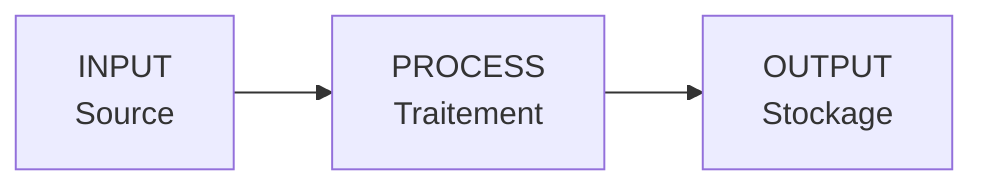
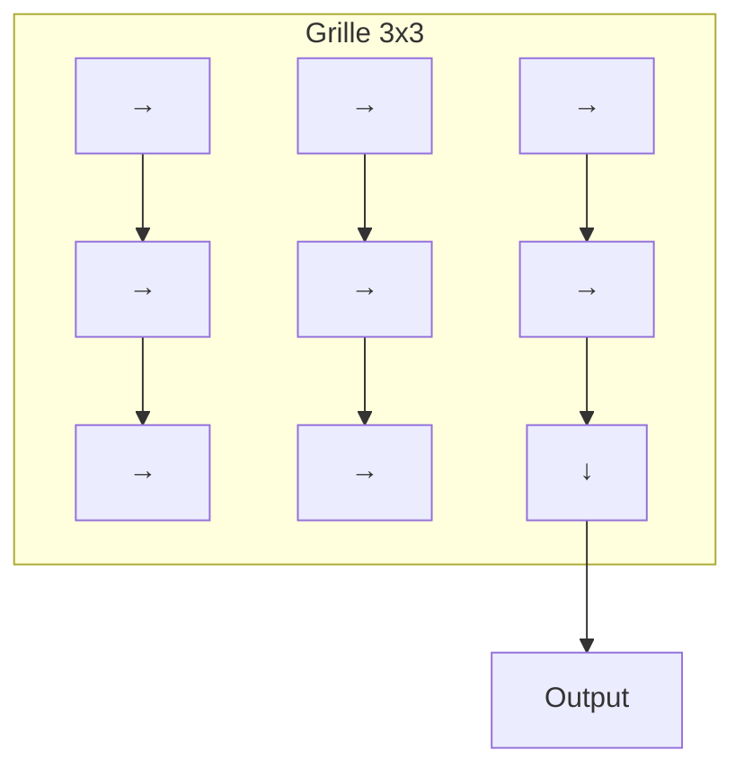
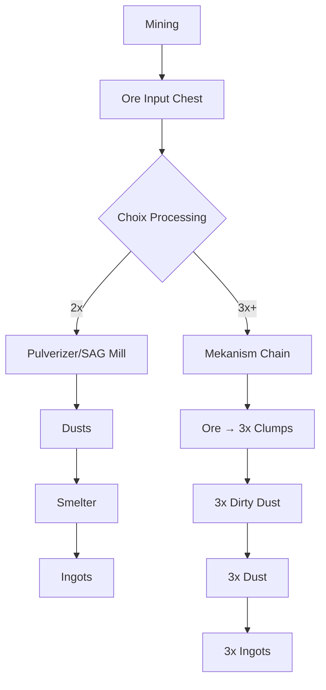
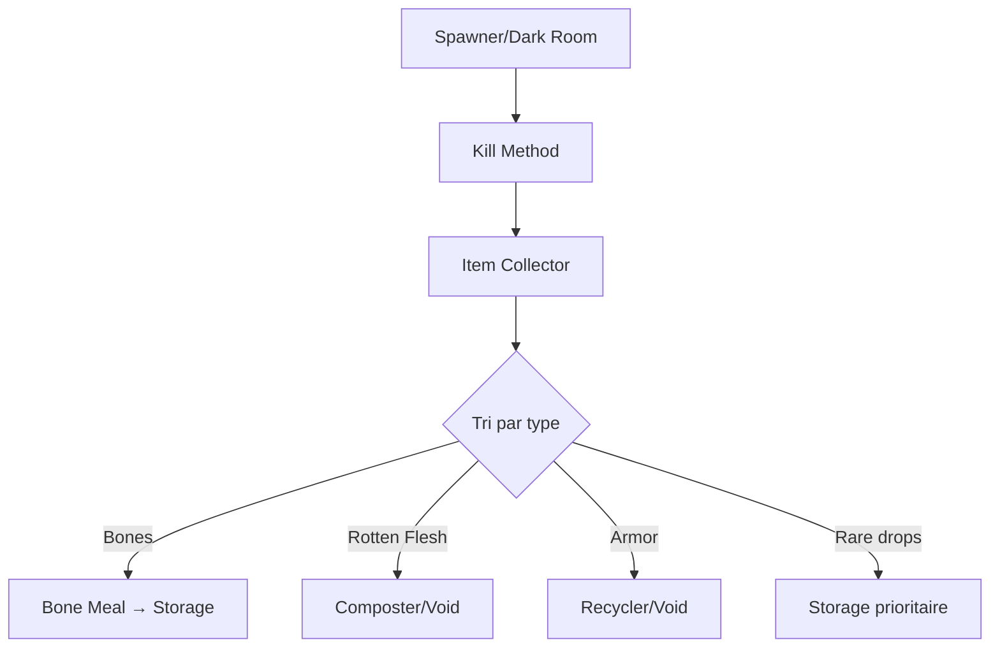
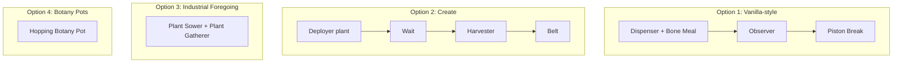
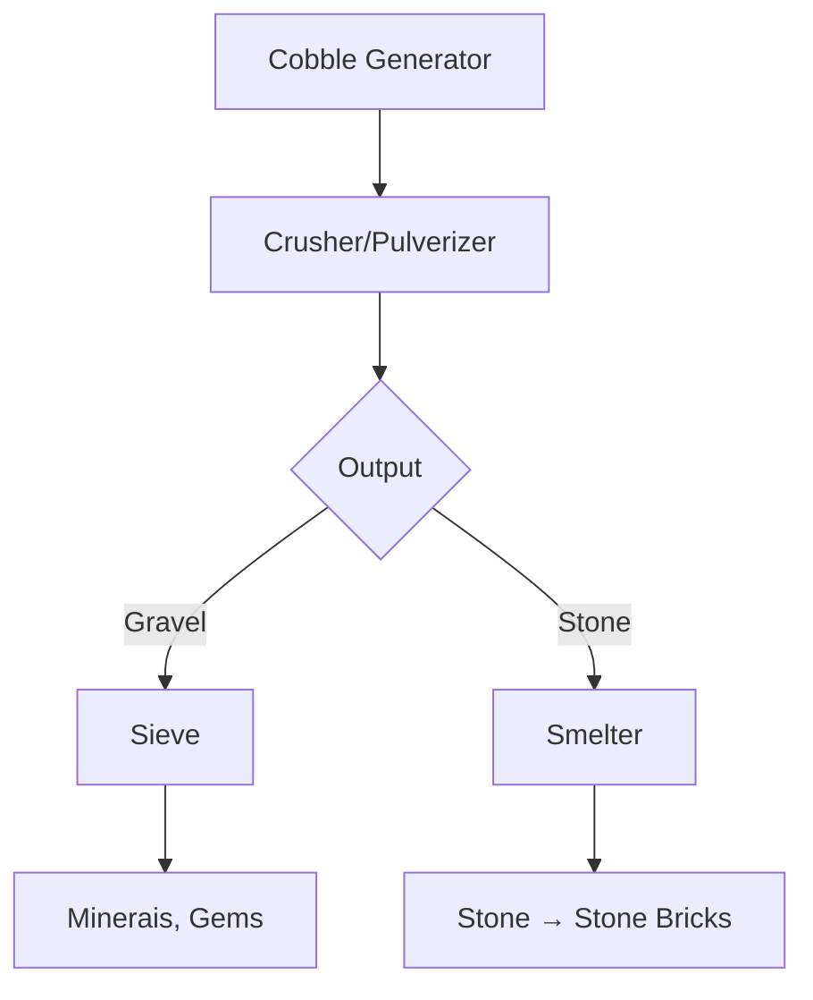
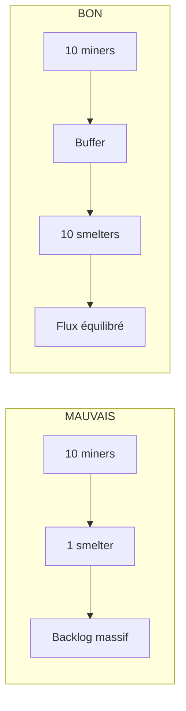
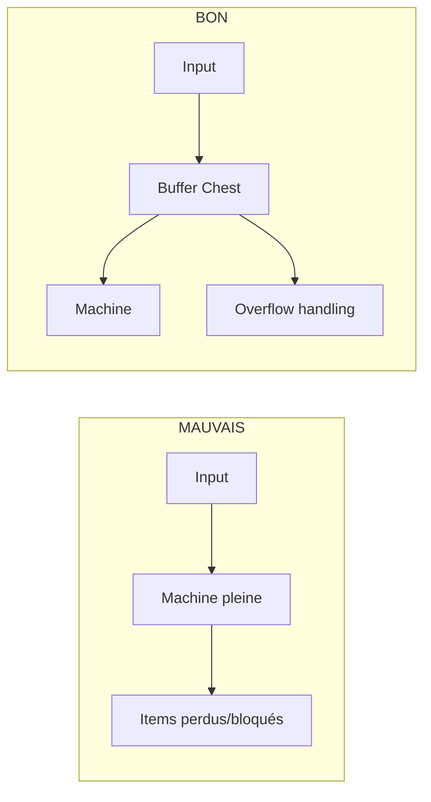
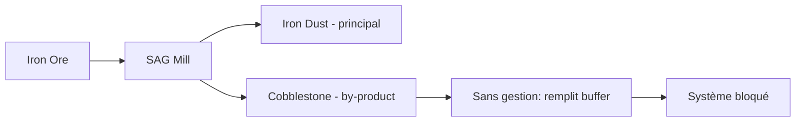
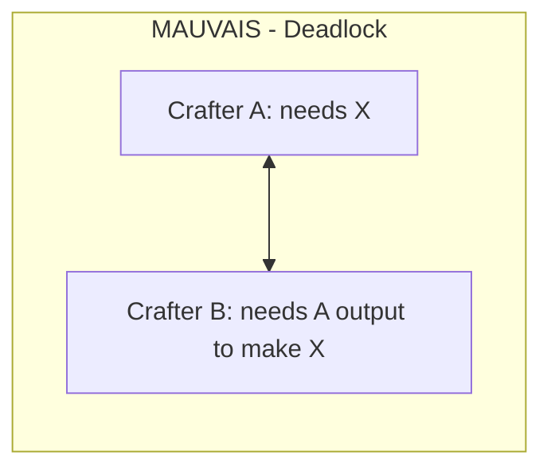

# Guide des Bases de l'Automatisation

L'automatisation est le coeur de toute progression en modpack. Ce guide couvre les concepts fondamentaux et les outils disponibles pour créer des systèmes efficaces.

---

## Principes Fondamentaux

### Le Modèle Input → Process → Output

Toute automatisation suit ce schéma universel :



| Composant | Rôle | Exemples |
|-----------|------|----------|
| **Input** | Source des ressources | Coffre, générateur, farm |
| **Process** | Transformation | Fournaise, machine, crafter |
| **Output** | Destination finale | Stockage, autre machine, void |

### Pourquoi Automatiser ?

!!! success "Avantages de l'automatisation"
    - **Gain de temps** : Les machines travaillent pendant que vous explorez
    - **Efficacité** : Traitement 24/7 sans intervention
    - **Scalabilité** : Facile d'augmenter la production
    - **Satisfaction** : Le plaisir de voir un système fonctionner seul

### Quand Automatiser vs Manuel ?

=== "Automatiser si..."

    - Tâche répétitive (smelting, crafting basique)
    - Grande quantité nécessaire
    - Ressource consommée régulièrement
    - Process multi-étapes complexe

=== "Rester manuel si..."

    - Usage ponctuel ou rare
    - Coût d'automatisation > bénéfice
    - Début de partie (ressources limitées)
    - Craft unique ou expérimental

!!! tip "Règle du 3"
    Si vous faites la même action plus de 3 fois, envisagez l'automatisation.

---

## Transport d'Items

### Comparaison des Méthodes de Transport

| Méthode | Mod | Vitesse | Coût | Filtrage | Complexité |
|---------|-----|---------|------|----------|------------|
| Hopper Vanilla | Vanilla | Lent | Très bas | Non | Très simple |
| Wooden Hopper | Various | Lent | Très bas | Non | Très simple |
| Pretty Pipes | Pretty Pipes | Moyen | Bas | Oui | Simple |
| Itemducts | Thermal | Rapide | Moyen | Oui | Moyen |
| Logistical Transporters | Mekanism | Rapide | Moyen | Oui | Moyen |
| Item Conduits | Ender IO | Très rapide | Moyen-Haut | Oui | Moyen |
| Entangled Block | Entangled | Instantané | Haut | Non | Simple |
| Ender Chest | Ender Storage | Instantané | Haut | Non | Simple |

---

### Hoppers (Vanilla & Modded)

=== "Hopper Vanilla"

    ```
    Crafting: 5 Iron + 1 Chest

    Caractéristiques:
    - 8 items/seconde
    - Tire depuis le dessus
    - Pousse vers la direction pointée
    - Désactivable par redstone
    ```

    !!! warning "Limitations"
        - Pas de filtrage natif
        - Cause du lag en grande quantité
        - Direction fixe une fois placé

=== "Wooden Hopper"

    ```
    Crafting: 5 Wood + 1 Chest (varie selon le mod)

    Caractéristiques:
    - Alternative early-game
    - Même fonctionnement que vanilla
    - Économise le fer
    ```

---

### Pipes (Systèmes Modulaires)

=== "Pretty Pipes"

    **Le système le plus accessible pour débuter**

    | Composant | Fonction |
    |-----------|----------|
    | Pipe | Transport de base |
    | Extraction Module | Tire les items d'un inventaire |
    | Filter Module | Filtre ce qui passe |
    | Speed Module | Augmente la vitesse |
    | Retrieval Module | Demande des items spécifiques |

    ```mermaid
    flowchart LR
        A[Coffre] -->|Extraction Module| B[Pipe]
        B --> C[Pipe]
        C --> D[Machine]
    ```

    !!! tip "Astuce Pretty Pipes"
        Les modules Low/Medium/High déterminent la capacité de filtrage et la vitesse.

=== "Thermal Itemducts"

    **Système polyvalent et performant**

    | Type | Utilisation |
    |------|-------------|
    | Itemduct | Transport standard |
    | Itemduct (Opaque) | Moins de lag (pas de rendu items) |
    | Impulse Itemduct | Transport instantané |
    | Warp Itemduct | Téléportation longue distance |

    | Composant | Fonction |
    |-----------|----------|
    | Servo | POUSSE depuis l'inventaire |
    | Retriever | TIRE vers l'inventaire |
    | Filter | Contrôle ce qui passe |

    !!! info "Niveaux de Servo"
        Reinforced → Signalum → Resonant (vitesse et slots de filtre croissants)

=== "Mekanism Transporters"

    **Haute performance avec visual feedback**

    | Composant | Fonction |
    |-----------|----------|
    | Logistical Transporter | Transport d'items |
    | Restrictive Transporter | Chemin de dernier recours |
    | Diversion Transporter | Contrôle redstone |
    | Logistical Sorter | Tri et filtrage avancé |

    !!! info "Couleurs de tri"
        - Assignez des couleurs aux destinations
        - Le sorter route par couleur
        - Permet des systèmes complexes

---

### Conduits (Ender IO)

**Solution tout-en-un compacte**

!!! success "Avantage majeur"
    Plusieurs types de conduits dans le même bloc ! Items + Fluides + Énergie dans un seul espace.

| Type de Conduit | Transporte |
|-----------------|------------|
| Item Conduit | Items |
| Fluid Conduit | Fluides |
| Energy Conduit | Énergie (FE/RF) |
| Redstone Conduit | Signal redstone |
| ME Conduit | Réseau AE2 |

| Mode de connexion | Description |
|-------------------|-------------|
| Insert | Pousse dans l'inventaire |
| Extract | Tire de l'inventaire |
| Insert + Extract | Les deux |
| Disabled | Connexion désactivée |

*Configuration via clic droit avec Yeta Wrench*

=== "Filtrage Item Conduit"

    | Filtre | Slots | Fonctions |
    |--------|-------|-----------|
    | Basic | 5 | Whitelist/Blacklist |
    | Advanced | 10 | + NBT, Damage |
    | Speed Upgrade | - | Augmente le débit |

=== "Round Robin"

    Active "Round Robin" pour distribuer équitablement entre plusieurs destinations.

    | Mode | Comportement |
    |------|--------------|
    | Sans RR | Tout va dans la 1ère fournaise disponible |
    | Avec RR | Distribution 1→2→3→1→2→3... |

---

### Item Collectors

**Ramassage automatique dans une zone**

| Mod | Block | Range | Spécial |
|-----|-------|-------|---------|
| Mob Grinding Utils | Item Collector | 9x9 configurable | Filtre intégré |
| Industrial Foregoing | Item Collector | Upgradeable | Addons de range |
| Cyclic | Collector | 10 blocks | Simple et efficace |
| Modular Routers | Item Router | Flexible | Modules combinables |

!!! tip "Usage optimal"
    Placez au centre de votre zone de drop (mob farm, tree farm, etc.)

---

### Transport Wireless

=== "Entangled Block"

    **Fonctionnement:**

    1. Craft Entangled Block + Entangled Binder
    2. Shift+clic droit sur bloc source avec Binder
    3. Place Entangled Block ailleurs
    4. L'Entangled Block "devient" le bloc source

    !!! success "Cas d'usage parfait"
    - Accès distant à un coffre
    - Connecter machines éloignées
    - Bypass de longues distances

=== "Ender Chests"

    **Partage d'inventaire à distance infinie**

    | Variante | Mod | Particularité |
    |----------|-----|---------------|
    | Ender Chest Vanilla | Vanilla | Personnel au joueur |
    | Ender Chest (coloré) | Ender Storage | Code couleur = canal |
    | Ender Tank | Ender Storage | Pour les fluides |

    !!! info "Système de couleurs (Ender Storage)"
        - 3 slots de couleur = 16³ = 4096 canaux
        - Même couleur = même inventaire
        - Diamond sur lock = personnel

---

## Filtrage et Tri

### Servo Filters (Thermal)

| Type de filtrage | Description |
|------------------|-------------|
| **Whitelist** | SEULS ces items passent |
| **Blacklist** | TOUT SAUF ces items |
| **NBT Match** | Vérifie les données NBT |
| **Metadata** | Vérifie les sous-types |
| **Ore Dict** | Accepte équivalents (tags) |

=== "Configuration Servo"

    1. Place servo sur itemduct connecté à un inventaire
    2. Clic droit pour ouvrir GUI
    3. Configure whitelist/blacklist
    4. Place items de référence dans les slots
    5. Ajuste redstone control si nécessaire

=== "Exemple Tri Minerais"

    ```mermaid
    flowchart TD
        A[Coffre Input] --> B{Servo Whitelist: Fer}
        B -->|Fer| C[Fournaise Fer]
        B -->|Autres| D{Servo Whitelist: Or}
        D -->|Or| E[Fournaise Or]
        D -->|Autres| F[Coffre Divers]
    ```

---

### Drawer Controllers (Storage Drawers)

**Tri automatique par type**

Configuration basique: Grille de Drawers (D) avec un Controller (C) au centre. Le Controller donne accès à tous les drawers connectés.

| Composant | Fonction |
|-----------|----------|
| Drawer Controller | Point d'accès unique à tous les drawers connectés |
| Drawer (1/2/4 slots) | Stockage massif mono-type |
| Compacting Drawer | Convertit auto (nugget↔ingot↔block) |
| Controller Slave | Étend le réseau sans accès |
| Trim | Connecte sans stocker |

!!! tip "Astuce tri"
    Connectez un pipe au Controller. Les items vont automatiquement dans le drawer approprié s'il existe, sinon restent dans le pipe.

---

### Storage Buses (AE2/RS)

=== "AE2 Storage Bus"

    **Intègre un inventaire externe au réseau ME**

    ```mermaid
    flowchart LR
        A[Coffre/Machine] --> B[Storage Bus]
        B --> C[Cable ME]
        C --> D[Réseau]
    ```

    | Setting | Effet |
    |---------|-------|
    | Priority | Plus haut = stocké en premier |
    | Partition | Limite aux items spécifiés |
    | Access | Read/Write/Read-Write |
    | Fuzzy | Ignore damage/NBT |

=== "RS External Storage"

    **Équivalent Refined Storage**

    | Configuration | Description |
    |---------------|-------------|
    | Priority | Ordre de stockage |
    | Whitelist/Blacklist | Filtrage des items |
    | Compare modes | NBT, damage |
    | Access modes | Lecture/Écriture |

!!! info "Pattern courant"
    Storage Bus sur Drawer Controller = stockage massif intégré au réseau avec tri automatique.

---

## Auto-Crafting

### Comparaison des Systèmes

| Système | Mod | Complexité | Scalabilité | Coût |
|---------|-----|------------|-------------|------|
| RFTools Crafter | RFTools | Simple | Moyenne | Bas |
| Sequential Fabricator | Thermal | Simple | Basse | Bas |
| ME Auto-Crafting | AE2 | Complexe | Très haute | Haut |
| RS Auto-Crafting | Refined Storage | Moyen | Haute | Moyen |
| Mechanical Crafter | Create | Moyen | Moyenne | Moyen |
| Wixie | Ars Nouveau | Simple | Basse | Magie |

---

### RFTools Crafter

=== "Setup"

    ```
    Crafting: Machine Frame + Crafting Table + Redstone

    Caractéristiques:
    - 8 recettes programmables
    - Garde les items internes ou output externe
    - Consomme RF
    - Chainable pour recettes complexes
    ```

=== "Configuration"

    1. Place la recette dans la grille fantôme
    2. Clic sur "Apply"
    3. Configure Keep/Output pour le résultat
    4. Alimente en items (hopper, pipe)
    5. Fournit RF

    !!! tip "Multi-étapes"
        Mets plusieurs crafters en série pour les recettes qui nécessitent des composants intermédiaires.

---

### Thermal Sequential Fabricator

| Caractéristique | Description |
|-----------------|-------------|
| Recettes | Craft automatique avec 1 recette |
| Vitesse | Rapide et simple |
| Augments | Vitesse, efficacité disponibles |

| Augment | Effet |
|---------|-------|
| Auxiliary Sieve | Chance de récupérer des inputs |
| Fluidic Fabrication | Utilise fluides dans les recettes |
| Parabolic Flux | Plus de RF = plus rapide |

---

### AE2 Auto-Crafting

=== "Composants requis"

    | Block | Fonction |
    |-------|----------|
    | ME Pattern Provider | Envoie les patterns aux machines |
    | ME Crafting CPU | Gère les jobs de craft (1 par craft simultané) |
    | Crafting Storage | Mémoire pour les crafts en cours |
    | Molecular Assembler | Craft les recettes "processing" internes |
    | ME Interface | Accès bidirectionnel inventaire ↔ réseau |

=== "Types de Patterns"

    | Pattern Type | Usage |
    |--------------|-------|
    | **Processing Pattern** | Pour machines externes (fournaise, etc.) - Input → Output défini manuellement |
    | **Crafting Pattern** | Pour crafting table standard - Recette classique 3x3 |

=== "Setup Basique"

    1. Encode pattern dans ME Pattern Encoding Terminal
    2. Place dans Pattern Provider adjacent à la machine
    3. Configure ME Interface pour récupérer l'output
    4. Demande le craft via ME Terminal

!!! warning "Pièges courants AE2"
    - CPU plein = craft bloqué (ajouter storage)
    - Pattern Provider sans machine = items perdus
    - Channels limités (8 par cable, 32 par dense)

---

### Refined Storage Auto-Crafting

=== "Composants"

    | Block | Fonction |
    |-------|----------|
    | Crafter | Stocke patterns et craft |
    | Crafter Manager | Vue centralisée des crafters |
    | Pattern Grid | Encode les patterns |
    | External Storage | Connecte machines externes |

=== "Avantages vs AE2"

    - Pas de système de channels
    - Setup plus simple
    - Crafters chainables par priorité
    - Moins de composants nécessaires

---

### Create Mechanical Crafters

**Crafting visuel et mécanique**



*Les flèches indiquent la direction du flux vers la sortie*

| Élément | Fonction |
|---------|----------|
| Mechanical Crafter | 1 slot de la grille |
| Rotation | Définit le flux vers la sortie |
| Cog/Shaft | Fournit la rotation pour crafter |
| Slot Cover | Bloque un slot (recettes < 9 items) |

!!! success "Points forts"
    - Visuellement satisfaisant
    - Pas d'énergie (RF), juste rotation
    - Peut crafter des items qui nécessitent Mechanical Crafter

---

### Wixies (Ars Nouveau)

**Auto-crafting magique**

**Setup:**

1. Place un Arcane Pedestal
2. Mets l'item RESULTAT voulu dessus
3. Summon un Wixie (Wixie Charm)
4. Place coffres à proximité avec ingrédients
5. Wixie craft automatiquement dans le coffre adjacent

!!! info "Caractéristiques"
    - Pas d'énergie requise
    - Range limité (coffres proches)
    - Un Wixie = une recette
    - Charm craftable avec source gem + améthyste

---

## Patterns d'Automation Courants

### Ore Processing Chain



=== "2x Processing (Simple)"

    | Étape | Machine | Output |
    |-------|---------|--------|
    | Ore | Pulverizer / SAG Mill | 2x Dust |
    | Dust | Fournaise / Induction Smelter | Ingots |

=== "3x+ Processing (Mekanism)"

    | Étape | Machine | Output |
    |-------|---------|--------|
    | Ore | Enrichment Chamber | Shard |
    | Shard | Purification Chamber (+Oxygen) | Clump |
    | Clump | Crusher | Dirty Dust |
    | Dirty Dust | Enrichment Chamber | Dust |
    | Dust | Energized Smelter | Ingot |

=== "5x Processing (Mekanism Avancé)"

    Nécessite Chemical Injection, Chemical Dissolution, et beaucoup d'infrastructure gaz/fluide.

---

### Mob Farm → Items



**Kill Methods disponibles:**

- Spikes (Mob Grinding Utils)
- Fan + Lava (Create)
- Player-damage (pour XP/looting)

!!! tip "Optimisations"
    - Looting sur l'arme/kill method pour plus de drops
    - Cursed Earth ou Mob Spawner pour spawn rate
    - Vector Plate pour déplacer les mobs vers le kill point

---

### Tree Farm

=== "Create Tree Farm"

    ```mermaid
    flowchart LR
        A[Deployer + Sapling] --> B[Attendre]
        B --> C[Mechanical Saw]
        C --> D[Items]
        D -->|Tri: Sapling| A
    ```

=== "Industrial Foregoing"

    ```mermaid
    flowchart TD
        A[Plant Gatherer] <--> B[Plant Sower]
        A --> C[Output Chest]
        C -->|Sapling| B
        C --> D[Logs, Saplings, Apples]
    ```

=== "Botany Pots (Modded)"

    | Configuration | Description |
    |---------------|-------------|
    | Setup | Botany Pot + Hopper + Appropriate Soil |
    | Avantage | Compact |
    | Vitesse | Configurable (soil type) |
    | Harvest | Auto-harvest avec Hopper dessous |

---

### Crop Farm



| Méthode | Avantage | Inconvénient |
|---------|----------|--------------|
| Vanilla | Pas de mod requis | Lag si grand scale |
| Create | Visuel cool | Setup complexe |
| IF | Très efficace | Coût RF |
| Botany Pots | Ultra compact | Un pot par crop |

---

### Cobblegen → Stone → Resources



**Types de Cobble Generator:**

- Transfer Node + Mining Upgrade (Extra Utils)
- Cobblestone Generator (IF)
- Block Placer + Block Breaker

!!! success "Progression Ex Nihilo"
    Cobble → Gravel → Sand → Dust → Sieve chaque étape pour ressources variées.

---

## Erreurs Courantes d'Automation

### Erreur 1: Goulots d'Étranglement

!!! failure "Le problème"
    Une partie du système est plus lente que le reste, créant des backlogs.



**Solution**: Identifie le bottleneck et scale cette partie.

---

### Erreur 2: Pas de Buffer

!!! failure "Le problème"
    Items perdus quand une machine est pleine ou le système s'arrête.



**Solution**: Toujours un coffre buffer entre les étapes.

---

### Erreur 3: Mauvaise Gestion Overflow

!!! failure "Le problème"
    Système bloqué quand le stockage est plein.

**Solutions:**

1. Trash/Void pour items indésirables
2. Overflow vers stockage secondaire
3. Redstone control pour stopper input
4. Recycler les excès (composter, etc.)

| Item Type | Overflow Solution |
|-----------|-------------------|
| Cobble, Dirt | Trash/Void |
| Excès de ressources | ME/RS overflow |
| Items utiles | Stockage extension |

---

### Erreur 4: Ignorer les Sous-produits

!!! failure "Le problème"
    Les by-products s'accumulent et bloquent le système.



**Solution**: Filtre les outputs, void ou utilise les by-products.

---

### Erreur 5: Dépendances Circulaires

!!! failure "Le problème"
    Machine A attend output de B, B attend output de A = deadlock.



**Solutions:**

- Seed le système avec des items initiaux
- Utilise des buffers pour casser les cycles
- Évite les dépendances circulaires dans les patterns

---

### Erreur 6: Mauvais Dimensionnement Énergie

!!! failure "Le problème"
    Pas assez d'énergie pour toutes les machines = ralentissement.

**Diagnostic:**

- Machines lentes ou qui s'arrêtent
- Energy buffer toujours vide
- Production inconsistante

**Solution:**

1. Calcule la consommation totale (RF/t)
2. Vérifie la production (RF/t)
3. Production > Consommation + 20% marge
4. Ajoute energy storage pour les pics

---

### Checklist de Debug

!!! tip "Quand votre automation ne fonctionne pas"

    - [ ] Les pipes/conduits sont-ils connectés des deux côtés ?
    - [ ] Mode Extract activé côté source ?
    - [ ] Mode Insert activé côté destination ?
    - [ ] Filtres correctement configurés (whitelist vs blacklist) ?
    - [ ] Assez d'énergie pour toutes les machines ?
    - [ ] Buffer pas plein / destination pas pleine ?
    - [ ] Redstone signal ne bloque pas le système ?
    - [ ] Les items correspondent exactement (NBT, metadata) ?

---

## Résumé

| Concept | Points Clés |
|---------|-------------|
| **Principe** | Input → Process → Output, toujours |
| **Transport** | Commencer simple (hoppers/pipes), upgrader si besoin |
| **Filtrage** | Whitelist pour précision, Blacklist pour exclusion |
| **Auto-craft** | RFTools pour simple, AE2/RS pour scalable |
| **Patterns** | Buffer entre chaque étape, gérer overflow |
| **Debug** | Vérifier connexions, énergie, filtres, redstone |

!!! success "Conseil final"
    Commencez petit, testez chaque partie indépendamment, puis connectez. Un système complexe n'est qu'une série de systèmes simples liés ensemble.
