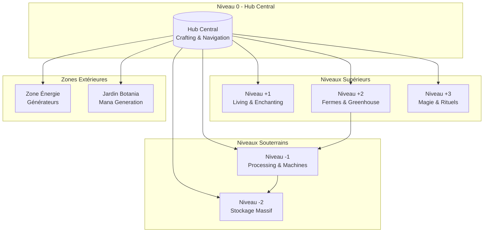
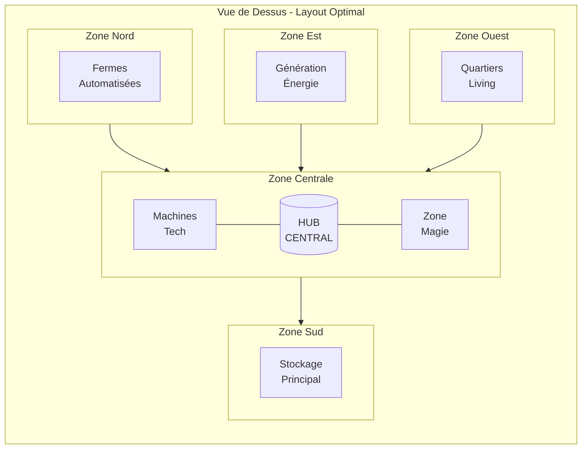
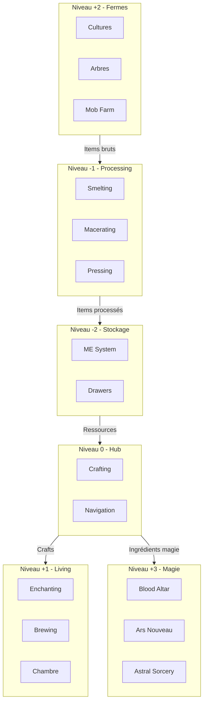

# Guide Complet : Construire une Base Moddée Organisée et Extensible

!!! abstract "Philosophie de Construction"
    Une base bien conçue est comme un organisme vivant : elle doit pouvoir **grandir**, **s'adapter** et rester **organisée** même après des centaines d'heures de jeu. Ce guide vous apprendra à construire une base qui ne deviendra jamais un chaos de câbles et de machines.

---

## 1. Principes de Base

!!! tip "Règle d'Or"
    **Planifier AVANT de construire.** Une heure de planification peut vous épargner dix heures de reconstruction.

### Les 3 Piliers d'une Base Réussie

| Pilier | Description | Application |
|--------|-------------|-------------|
| **Modularité** | Chaque zone est indépendante | Ajoutez des modules sans tout casser |
| **Extensibilité** | Prévoir la croissance | Laissez toujours de l'espace libre |
| **Accessibilité** | Navigation intuitive | Hub central avec accès à tout |

### Checklist Avant Construction

- [ ] Définir les mods que vous allez utiliser
- [ ] Estimer l'espace nécessaire par mod
- [ ] Choisir un emplacement avec assez d'espace
- [ ] Décider du style architectural
- [ ] Planifier le système de transport (items, énergie, fluides)

---

## 2. Layout Recommandé

### Concept du Hub Central

Le **hub central** est le coeur de votre base. Tout rayonne depuis ce point central, permettant un accès rapide à chaque zone.



### Vue de Dessus - Organisation des Zones



---

## 3. Dimensions Recommandées

!!! warning "Ne Sous-Estimez Pas l'Espace"
    La cause #1 des bases chaotiques est le **manque d'espace**. Doublez toujours vos estimations initiales.

### Tableau des Dimensions par Zone

| Zone | Taille Minimum | Taille Idéale | Hauteur | Notes |
|------|----------------|---------------|---------|-------|
| **Couloirs** | 3 blocs | 5 blocs | 4 blocs | Permet le passage des câbles |
| **Hub Central** | 9×9 | 15×15 | 6 blocs | Point de navigation principal |
| **Salle de Machines** | 9×9 | 15×15 | 5 blocs | Par type de processing |
| **Stockage AE2/RS** | 7×7 | 11×11 | 5 blocs | Controller + drives |
| **Stockage Drawers** | 9×5 | 15×7 | 4 blocs | Murs de tiroirs |
| **Altar Blood Magic** | 11×11 | 15×15 | 8 blocs | Espace pour les runes |
| **Jardin Botania** | 15×15 | 25×25 | Extérieur | Prévoir expansion |
| **Mekanism 5x** | 15×15 | 21×21 | 6 blocs | Setup complet processing |
| **Create Contraptions** | 11×11 | 19×19 | 8+ blocs | Hauteur pour les systèmes |
| **Ferme Automatisée** | 9×9 | 15×15 | 5 blocs | Par type de culture |
| **Enchanting Room** | 7×7 | 11×11 | 5 blocs | Bibliothèques autour |

### Règles de Dimensionnement

```
Formule Magique : Espace Nécessaire = Estimation × 2 + Buffer de 20%
```

!!! tip "Astuce Pro"
    Utilisez des **blocs placeholder** (dirt, cobblestone) pour visualiser l'espace avant de construire réellement.

---

## 4. Organisation par Étages

### Structure Verticale Recommandée

```
┌─────────────────────────────────────────────────────────────┐
│ Niveau +3  │ MAGIE & RITUELS                                │
│            │ Blood Magic altar, Ars Nouveau, Astral Sorcery │
├─────────────────────────────────────────────────────────────┤
│ Niveau +2  │ FERMES & GREENHOUSE                            │
│            │ Crops, arbres, mobs passifs, bees              │
├─────────────────────────────────────────────────────────────┤
│ Niveau +1  │ LIVING QUARTERS                                │
│            │ Chambre, enchanting, brewing, villagers        │
├─────────────────────────────────────────────────────────────┤
│ Niveau 0   │ HUB CENTRAL                                    │
│            │ Crafting, navigation, accès rapide             │
├─────────────────────────────────────────────────────────────┤
│ Niveau -1  │ PROCESSING & MACHINES                          │
│            │ Furnaces, macerators, processing chains        │
├─────────────────────────────────────────────────────────────┤
│ Niveau -2  │ STOCKAGE MASSIF                                │
│            │ ME/RS system, drawers, barrels                 │
└─────────────────────────────────────────────────────────────┘
```

### Diagramme de Flux entre Étages



---

## 5. Tips par Type de Mod

=== "Technologie"

    ### Mekanism

    !!! info "Espace pour 5x Processing"
        Le setup 5x ore processing de Mekanism nécessite beaucoup d'espace et de hauteur.

    | Composant | Espace Requis |
    |-----------|---------------|
    | Chemical Dissolution Chamber | 1×1×2 |
    | Chemical Washer | 1×1×2 |
    | Chemical Crystallizer | 1×1×2 |
    | Chemical Injection Chamber | 1×1×2 |
    | Purification Chamber | 1×1×2 |
    | **Total avec câbles** | **15×15×6 minimum** |

    ```
    Tips Mekanism:
    ├── Regrouper par fonction (gas, liquides, items)
    ├── Prévoir des tanks de buffer pour chaque gas
    ├── Laisser accès pour maintenance
    └── Utiliser des Configurators pour debug
    ```

    ### Thermal Series

    !!! tip "Conduits dans les Murs"
        Les conduits Thermal peuvent être cachés dans les murs pour une esthétique propre.

    - Utiliser des **covers** pour cacher les conduits
    - Prévoir des **gaines techniques** entre les murs
    - Les **servos** permettent de filtrer sans machines externes

    ### Create

    !!! warning "Hauteur Critique"
        Les contraptions Create nécessitent beaucoup de hauteur. Prévoyez **8+ blocs** minimum.

    - Systèmes de rotation : prévoir l'axe vertical
    - Trains : tunnels de 5×5 minimum
    - Crushing wheels : 3 blocs de hauteur

=== "Magie"

    ### Botania

    !!! abstract "Jardin Extérieur Recommandé"
        Les fleurs Botania fonctionnent mieux en extérieur avec accès au soleil.

    ```
    Layout Jardin Botania:
    ┌─────────────────────────────────┐
    │  [Endoflame] [Endoflame]        │
    │       [Mana Spreader]           │
    │            ↓                    │
    │       [Mana Pool]               │
    │            ↓                    │
    │    [Runic Altar] [Petal]        │
    │                   [Apothecary]  │
    └─────────────────────────────────┘
    ```

    - Espace pour expansion des fleurs
    - Prévoir luminaires (flowers ont besoin de lumière)
    - Zone séparée pour Pure Daisy (conversions lentes)

    ### Blood Magic

    !!! danger "Altar Room 11×11 Minimum"
        Le Tier 5 altar nécessite un espace conséquent avec les runes.

    | Tier | Taille Altar | Espace Salle |
    |------|--------------|--------------|
    | 1 | 1×1 | 5×5 |
    | 2 | 3×3 | 7×7 |
    | 3 | 5×5 | 9×9 |
    | 4 | 7×7 | 11×11 |
    | 5 | 9×9 | 15×15 |

    - Hauteur de 8 blocs pour Tier 4-5
    - Prévoir accès pour sacrifices (Well of Suffering)
    - Zone séparée pour Ritual of Binding

    ### Ars Nouveau

    - **Source generation** : zone dédiée avec accès eau/lave
    - **Enchanting apparatus** : 7×7 minimum
    - Espace pour **Imbuement Chamber** array

=== "Stockage"

    ### Applied Energistics 2 (AE2)

    !!! tip "Room for Controller + Drives"
        Planifiez l'expansion de votre ME system dès le début.

    ```mermaid
    flowchart LR
        subgraph ME["ME Room Layout"]
            CTRL["Controller<br/>Max 7×7×7"]
            DRIVES["Drive Bay<br/>32+ drives"]
            CRAFT["Crafting CPUs<br/>Multiple"]
            TERM["Terminals<br/>Accès"]
        end

        CTRL --- DRIVES
        CTRL --- CRAFT
        CTRL --- TERM
    ```

    | Composant | Espace | Quantité Recommandée |
    |-----------|--------|---------------------|
    | Controller | 1-343 blocs | Commencer petit |
    | ME Drives | 1×1 chacun | 16-64 drives |
    | Crafting CPUs | Variable | 3-5 CPUs |
    | Terminals | 1×1 | 4+ accès |

    ### Refined Storage (RS)

    - Setup similaire à AE2
    - **Controller** central avec **Disk Drives** autour
    - Prévoir espace pour **Crafters** et **Pattern Grid**

    ### Storage Drawers

    !!! info "Murs de Tiroirs"
        Les drawer walls sont parfaits pour le stockage early-game et le bulk storage.

    ```
    Optimal Drawer Wall:
    ┌─────────────────────────────┐
    │ [2×2][2×2][2×2][2×2][2×2]   │  ← Common items
    │ [2×2][2×2][2×2][2×2][2×2]   │  ← Common items
    │ [1×1][1×1][1×1][1×1][CTRL]  │  ← Overflow + Controller
    └─────────────────────────────┘
    ```

    - **Drawer Controller** pour accès centralisé
    - **Compacting Drawers** pour cobble/redstone/etc
    - Connecter au ME/RS via **Storage Bus**

---

## 6. Astuces de Construction

### Outils Indispensables

| Mod/Outil | Utilisation | Tip |
|-----------|-------------|-----|
| **Chisel & Bits** | Détails architecturaux | Parfait pour les finitions |
| **Building Gadgets** | Copier des structures | Copy-paste de sections entières |
| **Construction Wand** | Remplir rapidement | Extension automatique |
| **Effortless Building** | Symétrie, miroir | Constructions symétriques |
| **WorldEdit (si dispo)** | Modifications massives | //set, //replace |

### Techniques de Pro

!!! tip "Blueprints et Templates"
    Créez des templates pour vos designs récurrents :

    - **Machine room template** : 9×9 avec conduits pré-placés
    - **Corridor template** : 3×4 avec éclairage intégré
    - **Standard floor** : Hauteur et style cohérents

#### Gestion des Câbles et Conduits

```
Technique des Gaines Techniques:
┌─────────────────────────────────────┐
│ ░░░░░░░░░░░░░░░░░░░░░░░░░░░░░░░░░░░ │ ← Sol décoratif
│ ═══════════════════════════════════ │ ← Câbles énergie
│ ─────────────────────────────────── │ ← Conduits items
│ ═══════════════════════════════════ │ ← Conduits fluides
│ ░░░░░░░░░░░░░░░░░░░░░░░░░░░░░░░░░░░ │ ← Plafond
└─────────────────────────────────────┘
```

- Utiliser des **blocs pleins** pour cacher les câbles
- **Microblocks** pour covers élégantes
- Prévoir des **points d'accès** pour maintenance

#### Éclairage Intégré

!!! info "Éclairage Sans Torches"
    Mods recommandés pour l'éclairage propre :

    - **Fairy Lights** : Guirlandes décoratives
    - **Supplementaries** : Lampes intégrées
    - **Create** : Blocs lumineux industriels
    - **Botania** : Illuminating Flowers

---

## 7. Erreurs à Éviter

### Les 7 Péchés Capitaux du Base Building

!!! failure "1. Base Trop Petite"
    **Symptôme** : Machines entassées, pas de place pour expansion

    **Solution** : Multipliez toujours votre estimation par 2

!!! failure "2. Pas de Place pour Câbles"
    **Symptôme** : Câbles visibles partout, spaghetti de conduits

    **Solution** : Prévoir des gaines techniques entre les murs

!!! failure "3. Oublier le Chunk Loading"
    **Symptôme** : Machines qui s'arrêtent quand vous partez

    **Solution** :
    - FTB Chunks
    - Chicken Chunks
    - Anchor upgrades

!!! failure "4. Pas de Backup Power"
    **Symptôme** : Tout s'arrête quand le fuel manque

    **Solution** : Multiple sources d'énergie + batteries de backup

!!! failure "5. Mauvaise Organisation du Stockage"
    **Symptôme** : Impossible de trouver les items

    **Solution** :
    - Système ME/RS bien configuré
    - Labels et catégories
    - Sorters automatiques

!!! failure "6. Ignorer l'Esthétique"
    **Symptôme** : Base fonctionnelle mais laide

    **Solution** :
    - Prendre le temps de décorer
    - Utiliser des palettes de blocs cohérentes
    - Chisel pour variété

!!! failure "7. Construire Sans Plan"
    **Symptôme** : Extensions chaotiques, base incohérente

    **Solution** :
    - Sketcher sur papier d'abord
    - Utiliser des marqueurs in-game
    - Suivre un thème architectural

---

## 8. Checklist de Construction

### Phase 1 : Préparation

- [ ] Choisir l'emplacement (plat, ressources proches)
- [ ] Définir le style architectural
- [ ] Lister les mods à intégrer
- [ ] Calculer l'espace nécessaire

### Phase 2 : Fondations

- [ ] Creuser/niveler le terrain
- [ ] Poser les fondations du hub central
- [ ] Marquer les emplacements des zones
- [ ] Installer le chunk loading

### Phase 3 : Infrastructure

- [ ] Construire les couloirs principaux
- [ ] Installer les gaines techniques
- [ ] Poser le système d'énergie principal
- [ ] Créer le système de transport d'items

### Phase 4 : Zones Fonctionnelles

- [ ] Hub central et crafting
- [ ] Zone de stockage
- [ ] Salles de machines
- [ ] Zones spécialisées (magie, fermes)

### Phase 5 : Finitions

- [ ] Éclairage
- [ ] Décoration
- [ ] Signalétique
- [ ] Tests et optimisation

---

!!! success "Résumé"
    Une base réussie se construit en suivant ces principes :

    1. **Planifier** avant de construire
    2. **Surdimensionner** toujours
    3. **Modulariser** pour faciliter l'expansion
    4. **Organiser** avec un hub central
    5. **Automatiser** le chunk loading et le backup power
    6. **Décorer** pour le plaisir de jouer

---

*Bonne construction !*
