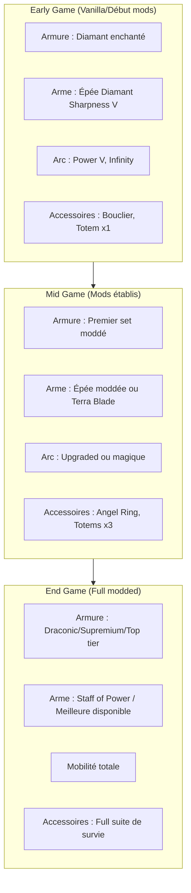

# Guide de Préparation aux Boss

Ce guide vous aidera à vous préparer efficacement pour affronter les boss du modpack, du plus simple au plus redoutable.

---

## Checklist Universelle Avant Boss

Avant d'affronter n'importe quel boss, assurez-vous d'avoir coché tous les éléments suivants :

### Équipement Minimum

| Élément | Description | Priorité |
|---------|-------------|----------|
| Armure complète | Adaptée au niveau du boss | :material-alert-circle: Obligatoire |
| Arme principale | Épée/arc avec enchantements | :material-alert-circle: Obligatoire |
| Arme de secours | En cas de casse | :material-check: Recommandé |
| Bouclier | Protection contre les projectiles | :material-check: Recommandé |

### Potions et Buffs

- [ ] **Régénération** - Minimum niveau II
- [ ] **Force** - Pour augmenter les dégâts
- [ ] **Résistance** - Réduit les dégâts subis
- [ ] **Vitesse** - Pour esquiver les attaques
- [ ] **Absorption** - Coeurs supplémentaires
- [ ] **Fire Resistance** - Selon le boss

### Totems et Survie

- [ ] **Totems of Undying** - Minimum 2-3 pour les boss difficiles
- [ ] **Golden Apples** - Enchanted si possible
- [ ] **Healing Items** - Bandages, médkits moddés

### Préparation Logistique

- [ ] **Waypoint de retour** - Configuré sur votre base
- [ ] **Coffre à proximité** - Avec équipement de secours
- [ ] **Lit posé** - Point de respawn proche
- [ ] **Inventaire organisé** - Hotbar optimisée

---

## Boss par Difficulté

=== "Facile"

    ### Boss Accessibles en Early-Game

    Ces boss peuvent être vaincus avec un équipement basique en diamant ou début de mods.

    #### Ender Dragon (Vanilla)

    | Aspect | Détails |
    |--------|---------|
    | **Équipement requis** | Armure diamant, arc avec Infinity/Power |
    | **Potions** | Slow Falling, Régénération |
    | **Stratégie** | Détruire les cristaux, puis DPS au sol |
    | **Rewards** | XP massif, accès aux End Cities, Dragon Egg |

    !!! tip "Astuce"
        Apportez des blocs pour grimper aux tours et une pioche pour casser les cages de fer.

    #### Wither (Vanilla)

    | Aspect | Détails |
    |--------|---------|
    | **Équipement requis** | Armure diamant enchantée, Smite V |
    | **Potions** | Régénération II, Force II |
    | **Stratégie** | Combat en espace confiné (bedrock ceiling) |
    | **Rewards** | Nether Star, XP |

    !!! tip "Astuce"
        Invoquez-le sous le portail du Nether au niveau bedrock pour le bloquer.

    #### Twilight Forest Bosses

    **Naga**

    - Équipement : Fer/Diamant basique
    - Stratégie : Frapper la tête, esquiver le corps
    - Reward : Naga Scale (armure)

    **Lich**

    - Équipement : Armure Naga ou diamant
    - Stratégie : Renvoyer ses projectiles, puis attaque directe
    - Reward : Sceptres magiques

    **Hydra**

    - Équipement : Bow avec Power, armure solide
    - Stratégie : Viser les têtes une par une
    - Reward : Hydra Chop (nourriture puissante)

=== "Moyen"

    ### Boss Mid-Game

    Ces boss nécessitent un équipement moddé et une bonne préparation.

    !!! warning "Attention"
        Ces boss infligent des dégâts significatifs. Prévoyez plusieurs totems.

    #### Blue Skies Bosses

    **Summoner**

    | Aspect | Détails |
    |--------|---------|
    | **Équipement requis** | Armure Blue Skies ou équivalent |
    | **Potions** | Force, Régénération |
    | **Stratégie** | Éliminer les invocations rapidement |
    | **Rewards** | Summoner's Bone, accès progression |

    **Starlit Crusher**

    | Aspect | Détails |
    |--------|---------|
    | **Équipement requis** | Armure renforcée, arme puissante |
    | **Potions** | Full buff set |
    | **Stratégie** | Mobilité constante, attaques fenêtrées |
    | **Rewards** | Matériaux avancés |

    #### Cataclysm Bosses

    **Netherite Monstrosity**

    - Localisation : Bastion moddé dans le Nether
    - Équipement : Netherite minimum, Fire Resistance obligatoire
    - Stratégie : Éviter les charges, frapper entre les attaques
    - Reward : Monstrous Horn

    **Ender Golem**

    - Localisation : End City moddée
    - Équipement : Armure End-tier
    - Stratégie : Combat technique avec phases
    - Reward : Void Core

    **The Leviathan**

    - Localisation : Structure océanique
    - Équipement : Depth Strider, Respiration
    - Stratégie : Combat aquatique, gérer l'oxygène
    - Reward : Leviathan Fang

    #### Ender Dragon (Moddé/Renforcé)

    !!! warning "Version Hardcore"
        Certains modpacks renforcent le dragon. Vérifiez les configs.

    - Équipement : Armure moddée mid-tier
    - Ajouts possibles : Plus de HP, nouvelles attaques, minions
    - Stratégie : Adaptez selon les modifications

=== "Difficile"

    ### Boss End-Game

    Ces boss représentent les défis ultimes du modpack.

    !!! danger "DANGER EXTRÊME"
        Ces boss peuvent one-shot même avec une bonne armure. Préparez-vous minutieusement!

    #### Chaos Guardian (Draconic Evolution)

    | Aspect | Détails |
    |--------|---------|
    | **Équipement requis** | Armure Draconic COMPLÈTE et chargée |
    | **Arme** | Draconic Bow ou Staff of Power |
    | **Obligatoire** | Flight (Angel Ring ou Draconic) |
    | **Stratégie** | Détruire les cristaux, kiter, DPS phases |
    | **Rewards** | Chaos Shards (crafts ultimes) |

    !!! danger "Attention"
        Le Chaos Guardian peut détruire votre armure instantanément si elle n'est pas assez chargée. Assurez-vous d'avoir des millions de RF stockés!

    **Préparation spécifique :**

    1. Armure Draconic avec tous les upgrades
    2. Bouclier Draconic activé
    3. Plusieurs sources d'énergie portables
    4. Waypoint LOIN de l'arène (explosion massive à la mort)

    #### Gaia Guardian (Botania)

    | Aspect | Détails |
    |--------|---------|
    | **Équipement requis** | Armure Terrasteel ou équivalent |
    | **Arme** | Terra Blade, Elementium avec Mana |
    | **Préparation** | Arène spécifique requise |
    | **Stratégie** | Gérer les spawns, DPS constant |
    | **Rewards** | Gaia Spirits (crafts end-game Botania) |

    !!! warning "Arène Obligatoire"
        Construisez l'arène selon les specs : beacon au centre, espace dégagé, pas de blocs cassables.

    **Gaia Guardian II :**

    - Encore plus difficile
    - Nécessite des Gaia Spirits pour l'invoquer
    - Rewards plus importants

    #### Atum Pharaoh

    | Aspect | Détails |
    |--------|---------|
    | **Équipement requis** | Armure haute qualité, arme anti-undead |
    | **Potions** | Full set, Smite fortement recommandé |
    | **Stratégie** | Combat en pyramide, gérer les pièges |
    | **Rewards** | Artifacts égyptiens, accès contenu Atum |

    !!! danger "Piège mortel"
        La pyramide contient de nombreux pièges. Progressez prudemment!

---

## Guide Détaillé par Boss

### Équipement Recommandé par Tier

### Stratégies Universelles

1. **Apprenez les patterns** - Chaque boss a des attaques prévisibles
2. **Gérez votre stamina** - Ne spammez pas les attaques
3. **Gardez une escape route** - Toujours avoir un plan B
4. **Communiquez en multi** - Coordonnez les rôles

---

## Farming de Boss

### Wither Automation

!!! tip "Farm Automatique"
    Avec les bons mods, le Wither peut être farmé automatiquement pour des Nether Stars infinies.

**Méthode Bedrock Ceiling :**

1. Créez une plateforme sous le plafond de bedrock du Nether
2. Invoquez le Wither - il sera coincé dans la bedrock
3. Utilisez un mob killer automatique (Mob Grinding Utils, etc.)
4. Collectez les Nether Stars automatiquement

**Méthode Wither Cage :**

- Certains mods permettent de créer des cages indestructibles
- Combine avec des systèmes de dégâts automatiques

### Dragon Respawn

**Méthode Vanilla :**

1. Placez 4 End Crystals sur le portail de sortie
2. Le dragon respawn
3. Répétez pour farm XP et Dragon's Breath

**Méthode Moddée :**

- Certains mods ajoutent des Dragon Eggs supplémentaires
- Possibilité de spawners dans certains modpacks

### Boss Spawners

!!! note "Disponibilité Variable"
    La disponibilité des spawners de boss dépend du modpack.

**Si disponible :**

- Mob Grinding Utils peut parfois capturer des boss
- Certains mods ajoutent des spawners craftables
- Vérifiez la config du modpack

---

## Items de Survie Essentiels

### Totems et Résurrection

| Item | Source | Effet |
|------|--------|-------|
| Totem of Undying | Evokers, Raids | Empêche une mort |
| Totem of Returning | Certains mods | TP à la base à la mort |
| Ankh Shield | Certains mods | Immunités multiples |

!!! tip "Stockage de Totems"
    Gardez toujours 5-10 totems en réserve. Farmez les raids régulièrement.

### Vol et Mobilité

| Item | Source | Avantage |
|------|--------|----------|
| Angel Ring | Extra Utilities | Vol créatif permanent |
| Draconic Chestplate | Draconic Evolution | Vol + armure |
| Jetpack | Mekanism/autres | Vol avec fuel |
| Elytra + Rockets | Vanilla | Vol économique |

!!! danger "Vol Obligatoire"
    Pour les boss comme le Chaos Guardian, le vol n'est pas optionnel - c'est une nécessité absolue.

### Enchantements de Survie

**Last Stand (si disponible) :**

- Consomme de l'XP au lieu de mourir
- Extrêmement puissant pour les boss

**Protection IV sur tout :**

- Stack pour une réduction massive des dégâts

**Mending :**

- Gardez votre équipement en état

### Healing Items

| Item | Vitesse | Efficacité |
|------|---------|------------|
| Golden Apple | Rapide | Bonne |
| Enchanted Golden Apple | Rapide | Excellente |
| Healing Potions | Instantané | Moyenne |
| Bandages (moddés) | Variable | Variable |
| Saturation Food | Continue | Bonne |

---

## Conseils Finaux

!!! success "Clés du Succès"
    1. **Ne sous-estimez jamais un boss** - Même les "faciles" peuvent surprendre
    2. **Pratiquez d'abord** - En créatif si possible
    3. **Backup votre monde** - Avant les boss difficiles
    4. **Patience** - Mieux vaut un combat long qu'une mort rapide

!!! danger "Erreurs Communes"
    - Oublier les totems
    - Armure non réparée/non chargée
    - Pas de point de respawn proche
    - Inventaire plein (pas de place pour le loot)
    - Attaquer sans connaître les mécaniques

---

## Checklist Rapide (à imprimer)

| Élément | Status |
|---------|--------|
| Armure complète et réparée | :material-checkbox-blank-outline: |
| Arme principale + backup | :material-checkbox-blank-outline: |
| Totems (x3 minimum pour boss moyens, x5+ pour difficiles) | :material-checkbox-blank-outline: |
| Potions buffantes | :material-checkbox-blank-outline: |
| Golden Apples | :material-checkbox-blank-outline: |
| Waypoint configuré | :material-checkbox-blank-outline: |
| Lit posé nearby | :material-checkbox-blank-outline: |
| Coffre de secours | :material-checkbox-blank-outline: |
| Inventaire organisé | :material-checkbox-blank-outline: |
| Connaissance des mécaniques du boss | :material-checkbox-blank-outline: |

Bonne chance, chasseur de boss!
