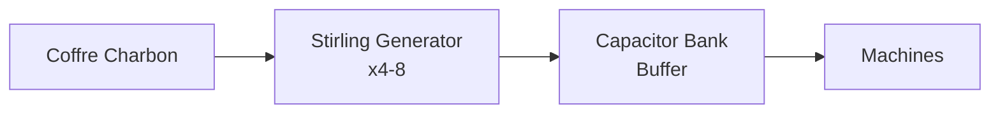
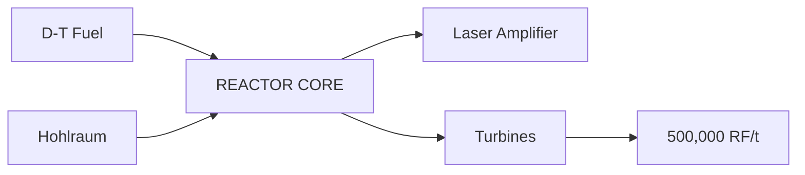
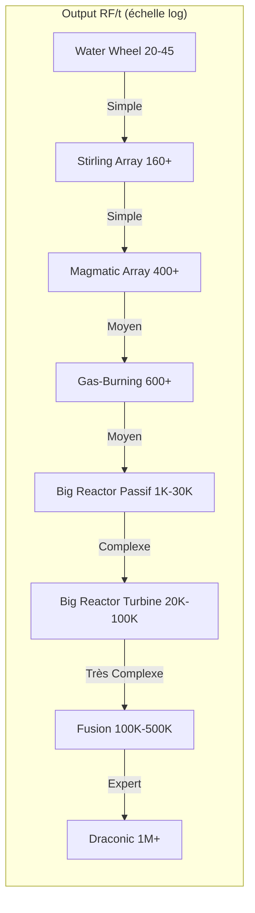
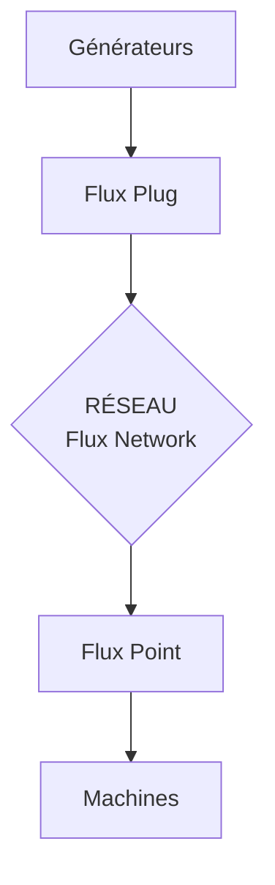
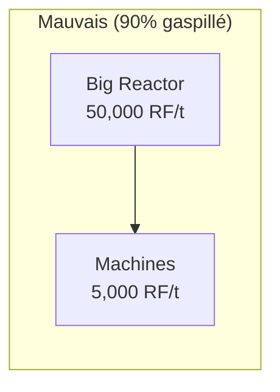
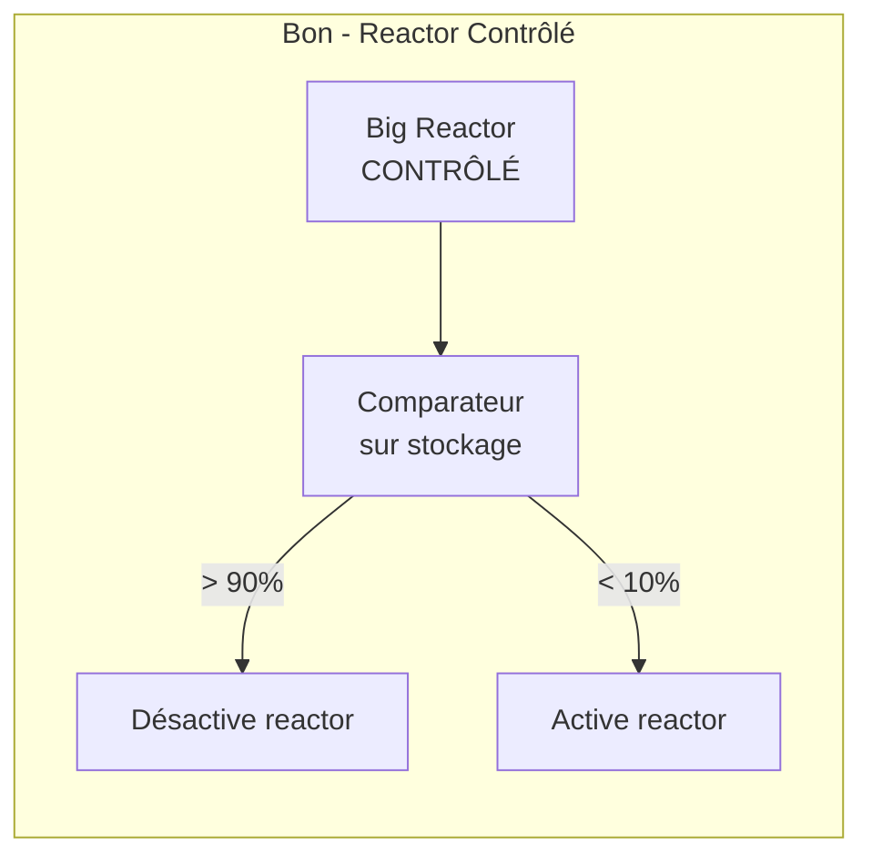
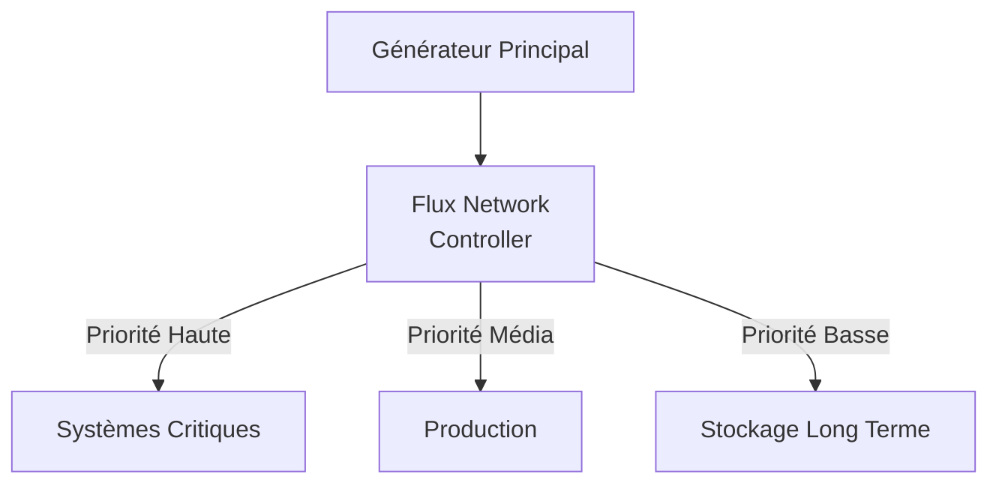

# Guide de Progression Énergétique

> La maîtrise de l'énergie est la clé de voute de tout modpack technique. Ce guide vous accompagne de vos premiers générateurs jusqu'aux structures les plus puissantes.

---

## 1. Comprendre l'Énergie

### Systèmes d'Unités

| Unité | Nom Complet | Mods Principaux | Conversion |
|-------|-------------|-----------------|------------|
| **RF** | Redstone Flux | Thermal, EnderIO, Immersive | Base |
| **FE** | Forge Energy | Standard Forge (1.12+) | 1:1 avec RF |
| **EU** | Energy Units | IC2, GregTech | Variable |
| **J** | Joules | Mekanism | 2.5 J = 1 RF |

!!! info "Compatibilité"
    La plupart des mods modernes utilisent FE/RF de manière interchangeable. Mekanism et IC2 ont leurs propres systèmes mais proposent souvent des convertisseurs.

### Les Trois Piliers

---

## 2. Progression par Phase

### Phase Early Game

!!! tip "Objectif : 100-500 RF/t"
    Suffisant pour les machines de base, le smelting automatisé et quelques outils.

| Générateur | Output | Combustible | Mod | Difficulté |
|------------|--------|-------------|-----|------------|
| Stirling Generator | 40 RF/t | Charbon | EnderIO | ★☆☆☆☆ |
| Furnace Generator | 40 RF/t | Combustibles | Actually Additions | ★☆☆☆☆ |
| Water Wheel | 20-45 RF/t | Eau courante | Immersive Engineering | ★★☆☆☆ |
| Survivalist Generator | 20 RF/t | Combustibles | Extra Utilities | ★☆☆☆☆ |
| Thermoelectric Generator | 10-40 RF/t | Différentiel thermique | Immersive Engineering | ★★☆☆☆ |
| Steam Dynamo | 80 RF/t | Eau + Chaleur | Thermal | ★★☆☆☆ |

!!! note "Setup Early Recommandé"
    Utilisez 4 à 8 Stirling Generators alimentés par un coffre de charbon, avec un Capacitor Bank comme buffer avant vos machines.

---

### Phase Mid Game

!!! tip "Objectif : 1,000-10,000 RF/t"
    Permet l'automatisation avancée, le processing ore, les quarries.

| Générateur | Output | Combustible | Mod | Difficulté |
|------------|--------|-------------|-----|------------|
| Magmatic Dynamo | 80-400 RF/t | Lave | Thermal | ★★☆☆☆ |
| Culinary Generator | 32-512 RF/t | Nourriture | Actually Additions | ★★☆☆☆ |
| Solar Panel T2-T3 | 64-256 RF/t | Lumière | Environmental Tech | ★★★☆☆ |
| Compression Dynamo | 150 RF/t | Carburants | Thermal | ★★★☆☆ |
| Gas-Burning Generator | 600+ RF/t | Ethylene | Mekanism | ★★★☆☆ |
| **Big Reactor** (petit) | 1,000-5,000 RF/t | Yellorium | Extreme Reactors | ★★★☆☆ |

!!! success "Big Reactors - Point Clé"
    Un petit Big Reactor (5x5x5) bien conçu peut produire 3,000+ RF/t et résoudre vos problèmes d'énergie pour longtemps.

**Big Reactor Basique (5x5x5) - Vue de dessus (intérieur 3x3):**

| Col 1 | Col 2 | Col 3 |
|:-----:|:-----:|:-----:|
| Y | C | Y |
| C | Y | C |
| Y | C | Y |

| Légende | Description |
|---------|-------------|
| **Y** | Yellorium Fuel Rod |
| **C** | Coolant (Gelid Cryotheum) |
| **Output** | ~3,000 RF/t |
| **Fuel efficiency** | Excellente |

---

### Phase Late Game

!!! tip "Objectif : 100,000+ RF/t"
    Pour les méga-projets, AE2 massif, terraforming, creative-like gameplay.

| Générateur | Output | Combustible | Mod | Difficulté |
|------------|--------|-------------|-----|------------|
| Big Reactor (turbine) | 20,000-100,000 RF/t | Steam | Extreme Reactors | ★★★★☆ |
| Fusion Reactor | 50,000-500,000 RF/t | D-T Fuel | Mekanism | ★★★★★ |
| Nuclearcraft Reactor | Variable | Uranium/Thorium | NuclearCraft | ★★★★★ |
| Draconic Reactor | 500,000+ RF/t | Awakened Draconium | Draconic Evolution | ★★★★★ |
| Solar T6 | 32,768 RF/t | Lumière | Environmental Tech | ★★★★☆ |

!!! danger "Draconic Reactor"
    Le Draconic Reactor peut **EXPLOSER** et détruire votre monde si mal géré ! Toujours construire dans une dimension séparée avec des systèmes de sécurité redondants.

---

## 3. Comparaison Complète des Générateurs

### Tableau Récapitulatif

| Générateur | RF/t | Coût Fuel | Setup | Mod | Phase |
|------------|------|-----------|-------|-----|-------|
| Survivalist Generator | 20 | Bas | Très Simple | ExU2 | Early |
| Stirling Generator | 40 | Bas | Simple | EnderIO | Early |
| Furnace Generator | 40 | Bas | Simple | AA | Early |
| Water Wheel | 20-45 | Gratuit | Moyen | IE | Early |
| Magmatic Dynamo | 80-400 | Moyen | Simple | Thermal | Mid |
| Culinary Generator | 32-512 | Variable | Moyen | AA | Mid |
| Gas-Burning (Ethylene) | 600+ | Moyen | Complexe | Mekanism | Mid |
| Big Reactor (passif) | 1K-30K | Bas | Moyen | ER | Mid |
| Big Reactor (turbine) | 20K-100K | Bas | Complexe | ER | Late |
| Mekanism Fusion | 50K-500K | Élevé | Très Complexe | Mekanism | Late |
| Draconic Reactor | 500K+ | Très Élevé | Expert | DE | Late |

### Efficacité vs Complexité

| Générateur | Output RF/t | Complexité |
|------------|-------------|------------|
| Water Wheel | 100 | Simple |
| Stirling Array | 1K | Simple |
| Magmatic Array | 1K | Simple |
| Gas-Burning | 1K | Moyen |
| Big Reactor Passif | 10K | Moyen |
| Big Reactor Turbine | 100K | Complexe |
| Fusion | 100K-500K | Très Complexe |
| Draconic | 1M+ | Expert |

---

## 4. Stockage d'Énergie

### Options par Capacité

| Stockage | Capacité | Tier | Mod | Notes |
|----------|----------|------|-----|-------|
| Basic Capacitor | 1M RF | Early | EnderIO | Stackable |
| Hardened Cell | 2M RF | Early | Thermal | Upgradable |
| Energy Cube (Basic) | 2M RF | Early | Mekanism | Upgradable |
| Vibrant Capacitor | 25M RF | Mid | EnderIO | Stackable |
| Energy Cube (Ultimate) | 64M RF | Mid | Mekanism | Bon ratio |
| **Induction Matrix** | 400B+ RF | Late | Mekanism | Scalable |
| **Draconic Energy Core** | 2.14T+ RF | Late | DE | Meilleur du jeu |

### Mekanism Induction Matrix

!!! success "Recommandation Late Game"
    L'Induction Matrix est le meilleur compromis stockage/coût pour le late game.

**Structure Induction Matrix (Exemple 3x3x3):**

| Composant | Fonction |
|-----------|----------|
| Induction Casing | Structure extérieure |
| Induction Cells | Stockage d'énergie |
| Induction Providers | Transfer rate |
| Induction Port (x1) | Entrée/Sortie |

| Configuration Typique | Valeur |
|----------------------|--------|
| 4x Ultimate Cells | Capacité |
| 3x Ultimate Providers | Débit |
| **Total Stockage** | 400B RF |
| **Transfer Rate** | 3.2M RF/t |

### Draconic Energy Core

| Tier | Taille Intérieure | Capacité |
|------|-------------------|----------|
| Tier 1 | 1x1x1 | 45.5M RF |
| Tier 2 | 3x3x3 | 273M RF |
| Tier 3 | 5x5x5 | 1.64B RF |
| Tier 4 | 7x7x7 | 9.88B RF |
| Tier 5 | 9x9x9 | 59.3B RF |
| Tier 6 | 11x11x11 | 356B RF |
| Tier 7 | 13x13x13 | **2.14T RF** (Maximum) |

---

## 5. Distribution d'Énergie

### Comparaison des Câbles

| Câble | Capacité | Perte | Mod | Coût |
|-------|----------|-------|-----|------|
| Leadstone Fluxduct | 1,000 RF/t | Non | Thermal | Bas |
| Hardened Fluxduct | 4,000 RF/t | Non | Thermal | Moyen |
| Redstone Fluxduct | 9,000 RF/t | Non | Thermal | Moyen |
| Signalum Fluxduct | 16,000 RF/t | Non | Thermal | Élevé |
| Resonant Fluxduct | 25,000 RF/t | Non | Thermal | Élevé |
| **Cryo-Stabilized Fluxduct** | Illimité | Non | Thermal | Très Élevé |
| Basic Cable | 8,000 FE/t | Non | Mekanism | Bas |
| Ultimate Cable | 256,000 FE/t | Non | Mekanism | Élevé |
| Superconductor | 1.28B FE/t | Non | Mekanism | Très Élevé |

### Solutions Wireless

!!! info "Flux Networks"
    La meilleure solution pour le transport wireless d'énergie.

**Avantages Flux Networks:**

| Fonctionnalité | Description |
|----------------|-------------|
| Cross-dimensional | Fonctionne entre dimensions |
| Priority system | Système de priorités configurable |
| Chunk loading | Optionnel intégré |
| Buffer intégré | Stockage tampon inclus |

### Transport Dimensional

| Solution | Cross-Dim | Setup | Mod |
|----------|-----------|-------|-----|
| Flux Networks | Oui | Simple | Flux Networks |
| Ender IO Conduits | Non | Simple | EnderIO |
| Tesseract | Oui | Simple | Thermal |
| Quantum Entangloporter | Oui | Moyen | Mekanism |
| Draconic RF Transfer | Oui | Complexe | DE |

---

## 6. Optimisation Énergétique

### Principe de Base

!!! warning "Règle d'Or"
    **Produire exactement ce que vous consommez** est plus efficace que surproduire et gaspiller.

### Ne Pas Surproduire

### Buffer Approprié

| Situation | Buffer Recommandé |
|-----------|-------------------|
| Machines constantes | 1-2 minutes de consommation |
| Machines par batch | 1 batch complet |
| Systèmes critiques | 10+ minutes |
| Quarry/Mining | Variable selon distance |

### Load Balancing

---

## Checklist de Progression

### Early Game
- [ ] Premier générateur (Stirling/Furnace)
- [ ] Buffer minimal (Basic Capacitor)
- [ ] Câblage basique aux machines

### Mid Game
- [ ] Source renouvelable (Magmatic/Big Reactor)
- [ ] Stockage 10M+ RF
- [ ] Réseau organisé avec conduits

### Late Game
- [ ] Production 100K+ RF/t
- [ ] Stockage 1B+ RF (Induction Matrix)
- [ ] Flux Networks pour distribution
- [ ] Système de backup

### End Game
- [ ] Fusion ou Draconic Reactor
- [ ] Stockage multi-trillion RF
- [ ] Automatisation complète du fuel
- [ ] Systèmes de sécurité

---

!!! quote "Conseil Final"
    L'énergie n'est pas une fin en soi, mais un moyen d'accomplir vos projets. Construisez ce dont vous avez besoin, pas ce qui paraît impressionnant.

*Voir aussi: [Stockage](../stockage/index.md) | [Mods Techniques](../technologie/index.md)*
