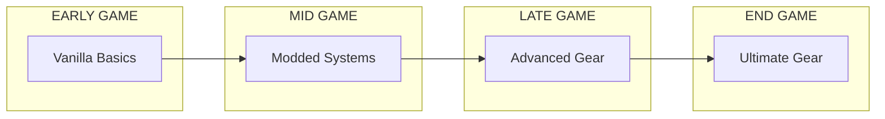
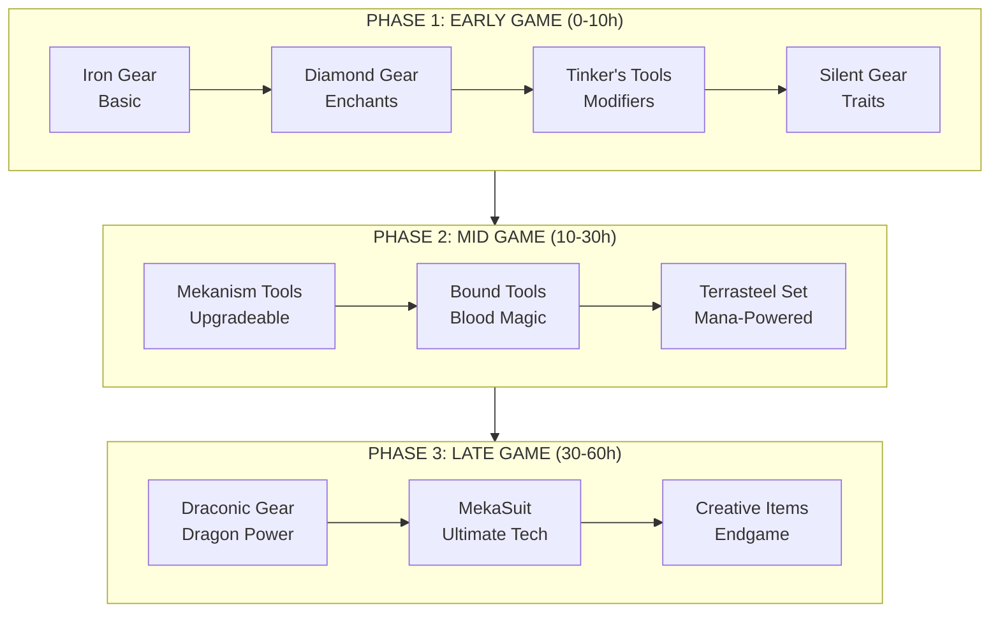
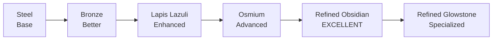
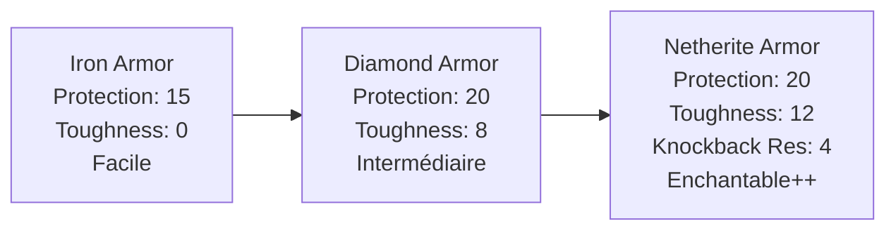
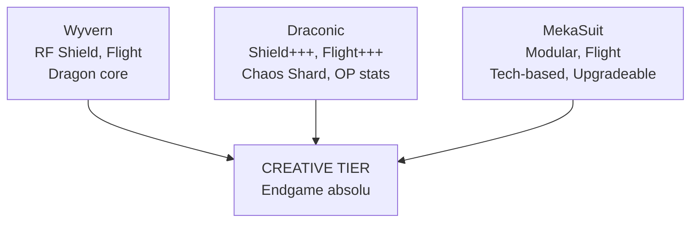
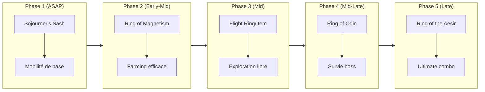
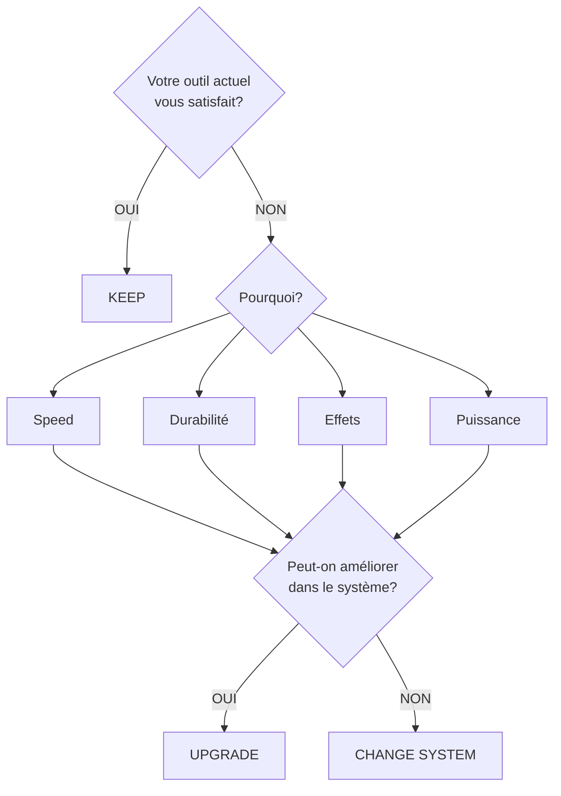

# Guide de Progression d'Équipement

> Guide complet pour optimiser votre progression d'équipement à travers les différentes phases du jeu.

---

## 1. Timeline de Progression

### Vue d'Ensemble

### Progression Détaillée

---

## 2. Comparaison des Systèmes d'Outils

### Tableau Comparatif Principal

| Système | Difficulté | Customisation | Puissance Max | Réparabilité | Évolutivité |
|---------|:----------:|:-------------:|:-------------:|:------------:|:-----------:|
| **Vanilla** | ★☆☆☆☆ | ★☆☆☆☆ | ★★☆☆☆ | ★★☆☆☆ | ★☆☆☆☆ |
| **Tinker's Construct** | ★★☆☆☆ | ★★★★☆ | ★★★☆☆ | ★★★★★ | ★★★★☆ |
| **Silent Gear** | ★★★☆☆ | ★★★★★ | ★★★★☆ | ★★★★★ | ★★★★★ |
| **Mekanism** | ★★★☆☆ | ★★★☆☆ | ★★★★☆ | ★★★★★ | ★★★★☆ |
| **Draconic Evolution** | ★★★★☆ | ★★★☆☆ | ★★★★★ | ★★★★★ | ★★★★★ |
| **Tetra** | ★★★★☆ | ★★★★★ | ★★★★☆ | ★★★★☆ | ★★★★★ |

### Détail par Système

=== "Vanilla"

    | Avantages | Inconvénients |
    |-----------|---------------|
    | Simple à comprendre | Très limité en customisation |
    | Ressources faciles | Pas d'évolution possible |
    | Enchantements standard | Réparation coûteuse (XP) |

    **Recommandé pour:** Début de partie, outils temporaires

=== "Tinker's Construct"

    | Avantages | Inconvénients |
    |-----------|---------------|
    | Réparation gratuite | Courbe d'apprentissage |
    | Modifiers puissants | Nécessite Smeltery |
    | Mix de matériaux | Moins puissant que late-game mods |

    **Recommandé pour:** Début/mid game, mining intensif

=== "Silent Gear"

    | Avantages | Inconvénients |
    |-----------|---------------|
    | Traits uniques | Système complexe |
    | Très customisable | Matériaux rares requis |
    | Synergie avec autres mods | Blueprints nécessaires |

    **Recommandé pour:** Joueurs qui veulent optimiser chaque stat

=== "Mekanism"

    | Avantages | Inconvénients |
    |-----------|---------------|
    | Très puissant | Coût en ressources élevé |
    | Upgrades modulaires | Infrastructure requise |
    | Rechargeable | Complexité technique |

    **Recommandé pour:** Joueurs tech, mining de masse

=== "Draconic Evolution"

    | Avantages | Inconvénients |
    |-----------|---------------|
    | Puissance maximale | Très coûteux |
    | Flight intégré | Dragon requis |
    | Shield system | Late game uniquement |

    **Recommandé pour:** Endgame, combat de boss

=== "Tetra"

    | Avantages | Inconvénients |
    |-----------|---------------|
    | Système modulaire unique | Interface complexe |
    | Compatible vanilla | Schematics nécessaires |
    | Évolution progressive | Documentation limitée |

    **Recommandé pour:** Immersion, progression naturelle

---

## 3. Meilleurs Matériaux par Mod

### Tinker's Construct

#### TIER S (Meilleurs)

| Matériau | Description |
|----------|-------------|
| Manyullyn | Dégâts max, idéal pour armes |
| Queen's Slime | Overslime massif, réparation facile |
| Hepatizon | Bonus de momentum, mining speed |

#### TIER A (Excellents)

| Matériau | Description |
|----------|-------------|
| Slimesteel | Overslime bonus, early game excellent |
| Pig Iron | Tasty + durabilité, sustain |
| Cobalt | Mining speed élevé |

#### TIER B (Bons pour début)

| Matériau | Description |
|----------|-------------|
| Bronze | Well-Maintained, durabilité |
| Rose Gold | XP bonus, enchanting |
| Amethyst | Bonus magiques |

#### Builds Recommandés Tinker's

**PIOCHE MINING OPTIMALE:**

| Partie | Matériau | Raison |
|--------|----------|--------|
| Head | Cobalt ou Hepatizon | Speed / Momentum |
| Binding | Queen's Slime | Overslime |
| Handle | Slimesteel | Durabilité + overslime |
| Modifiers | Haste, Luck, Experienced | - |

**ÉPÉE DPS MAXIMUM:**

| Partie | Matériau | Raison |
|--------|----------|--------|
| Blade | Manyullyn | Dégâts |
| Guard | Amethyst | Traits magiques |
| Handle | Pig Iron | Sustain |
| Modifiers | Sharpness, Sweeping, Looting | - |

### Silent Gear

#### Traits Offensifs

| Trait | Description |
|-------|-------------|
| Vorpal | Chance de décapitation et crit massif |
| Silky | Silk Touch intégré |
| Moonwalker | Bonus en basse lumière |

#### Traits Utilitaires

| Trait | Description |
|-------|-------------|
| Magnetic | Auto-pickup des items |
| Soft | Réparation facile |
| Crude | Bonus XP |

#### Matériaux Recommandés

| Matériau | Description |
|----------|-------------|
| Crimson Steel | High tier, excellentes stats globales |
| Azure Silver | Bonus magiques, anti-undead |
| Tyrian Steel | Durabilité exceptionnelle |
| Blaze Gold | Fire aspect, Nether utility |

### Mekanism

#### Progression des Matériaux

!!! tip "REFINED OBSIDIAN: Le meilleur matériau Mekanism"

    | Propriété | Valeur |
    |-----------|--------|
    | Durabilité | 4096 |
    | Mining Level | 4 |
    | Enchantability | 40 |
    | Utilisation | Paxel, Armor, tout! |

---

## 4. Armures - Progression

### Flowchart de Progression

#### EARLY GAME

#### MID GAME (Choix selon votre style)

=== "Terrasteel (Botania)"

    | Caractéristique | Description |
    |-----------------|-------------|
    | Énergie | Mana-powered |
    | Bonus | Great Fairy |
    | Spécial | Will of Gaia |
    | Accès | Flight access |
    | Style | **Magie** |

=== "Bound Armor (Blood Magic)"

    | Caractéristique | Description |
    |-----------------|-------------|
    | Énergie | LP-powered |
    | Bonus | Self-repair |
    | Spécial | Sigil compat |
    | Accès | Fall immune |
    | Style | **Sang** |

=== "Supremium (Mystical Ag)"

    | Caractéristique | Description |
    |-----------------|-------------|
    | Énergie | Farmable |
    | Bonus | Charm slots |
    | Spécial | Upgradeable |
    | Accès | Soul bonuses |
    | Style | **Farming** |

#### LATE GAME

### Tableau Comparatif des Armures Mid-Late Game

| Armure | Protection | Spécial | Coût | Source d'énergie |
|--------|:----------:|---------|:----:|:----------------:|
| **Terrasteel** | ★★★★☆ | Will of Gaia, Pixie spawn | Moyen | Mana |
| **Bound Armor** | ★★★★☆ | Self-repair, LP abilities | Moyen | Life Points |
| **Supremium** | ★★★★☆ | Charm slots, set bonus | Farming | Aucune |
| **Wyvern** | ★★★★★ | RF Shield, Flight | Élevé | RF Energy |
| **Draconic** | ★★★★★+ | Shield+++, All abilities | Très élevé | RF Energy |
| **MekaSuit** | ★★★★★ | Modular, Upgradeable | Très élevé | RF/FE Energy |

---

## 5. Accessoires (Curios)

### Slots et Catégories

| Slot | Types d'accessoires |
|------|---------------------|
| **HEAD** | Goggles, Crowns |
| **NECKLACE** | Pendants, Amulets |
| **BACK** | Capes, Wings |
| **BODY** | Charms, Badges |
| **HANDS** | Gloves, Bracelets |
| **RING** | Rings (x2), Bands |
| **BELT** | Belts, Sashes |
| **FEET** | Boots Add, Anklets |

### Accessoires Essentiels par Type

#### Rings (Anneaux)

=== "Magnetization"

    !!! info "Ring of Magnetization (Botania)"
        - Auto-pickup dans un rayon
        - Consomme Mana
        - **INDISPENSABLE pour farming**

=== "Flight"

    !!! info "Ring of the Flugel (Botania)"
        - Creative flight
        - Coût: Gaia Guardian + ressources
        - Mana drain constant

    !!! info "Angel Ring (Extra Utilities / Cyclic)"
        - Creative flight
        - Pas de coût d'utilisation
        - Coût de craft élevé

=== "Combat"

    !!! info "Ring of Odin (Botania)"
        - +10 Hearts
        - Poison/Wither immunity
        - Fire resistance

    !!! info "Ring of Thor (Botania)"
        - Extended mining reach
        - 3x3 mining

#### Belts (Ceintures)

| Rating | Ceinture | Effets |
|--------|----------|--------|
| :star::star::star::star::star: | **Sojourner's Sash** (Botania) | Step Assist, Speed boost, Jump boost, Fall damage reduction - **LE MEILLEUR accessoire early-mid game** |
| :star::star::star::star: | **Spectral Sash** (Upgrade) | Tous les effets de Sojourner's + Phasing through walls (shift) - Nécessite Gaia drops |
| :star::star::star::star: | **Superexhaling Sash** (Botania) | Underwater breathing, Water speed boost - Pour exploration océanique |

#### Charms & Relics

=== "Utility Charms"

    | Charm | Mod | Effet |
    |-------|-----|-------|
    | Charm of the Plunderer | Blood Magic | Looting bonus |
    | Charm of the Hunting Dog | Blood Magic | XP bonus |
    | Globetrotter's Sash | Botania | Max movement |
    | Pocket Wormhole | Cyclic | Ender chest access |

=== "Relics (Botania Gaia Guardian drops)"

    | Relic | Effet |
    |-------|-------|
    | Fruit of Grisaia | Hunger immunity |
    | Dice of Fate | Lucky drops |
    | Eye of the Flugel | Teleportation |
    | Thor's Ring | Voir section Rings |
    | Odin's Ring | Voir section Rings |
    | Loki's Ring | Multi-place blocks |
    | **Ring of the Aesir** | **COMBINED RINGS (Odin+Thor+Loki)** |

=== "Special Mentions"

    | Item | Effet |
    |------|-------|
    | Totem of Undying | One-time death prevention |
    | Ankh Shield (si disponible) | Multiple immunities |
    | Ender Queen's Crown | Enderman neutrality |

### Priorité d'Acquisition

---

## 6. Quand Upgrader vs Quand Changer de Système

### Arbre de Décision

### Guide par Situation

=== "Quand RESTER dans le système"

    **Tinker's Construct** - Restez si:

    - Vous pouvez encore ajouter des modifiers
    - Overslime pas au max
    - Matériaux upgradeables disponibles
    - Pas encore de Manyullyn/Queen's Slime

    **Silent Gear** - Restez si:

    - Traits non optimisés
    - Meilleurs matériaux disponibles
    - Parts peuvent être améliorées

    **Mekanism** - Restez si:

    - Upgrades pas au max
    - Modules manquants
    - Energy storage upgradeable

=== "Quand CHANGER de système"

    | Transition | Condition |
    |------------|-----------|
    | **Vanilla vers Tinker's** | Dès que Smeltery est construite - Réparation gratuite = game changer |
    | **Tinker's vers Mekanism/Draconic** | Quand vous avez accès au Nether, mining de masse nécessaire, infrastructure energy disponible |
    | **Tout vers Draconic** | Après avoir tué l'Ender Dragon, quand vous avez des Draconium, pour combattre le Chaos Guardian |
    | **Armor Mid vers MekaSuit** | Quand vous avez l'infrastructure Mekanism complète, quand vous voulez modularité maximale |

### Checklist de Transition

| Vérification | Status |
|--------------|--------|
| J'ai les ressources pour le nouveau système | :material-checkbox-blank-outline: |
| J'ai l'infrastructure nécessaire (machines, energy, etc.) | :material-checkbox-blank-outline: |
| Je comprends comment fonctionne le nouveau système | :material-checkbox-blank-outline: |
| Le nouveau système répond à mes besoins actuels | :material-checkbox-blank-outline: |
| J'ai gardé mes anciens outils en backup | :material-checkbox-blank-outline: |
| J'ai un plan pour la période de transition | :material-checkbox-blank-outline: |

!!! danger "Erreurs à éviter"
    - Détruire ses anciens outils avant d'avoir les nouveaux
    - Changer de système trop tôt (coût/bénéfice)
    - Ignorer un système intermédiaire utile
    - Sous-estimer le coût en ressources

---

## Résumé Visuel

!!! abstract "GEAR PROGRESSION - RÉSUMÉ RAPIDE"

    | Catégorie | Progression |
    |-----------|-------------|
    | **OUTILS** | Vanilla --> Tinker's --> Silent --> Mekanism --> Draconic |
    | **ARMURES** | Iron --> Diamond --> Netherite --> Terra/Bound --> Drac/Meka |
    | **CURIOS** | Sash --> Magnet Ring --> Flight --> Odin --> Aesir |

    !!! tip "Règle d'or"
        N'upgradez pas ce que vous allez remplacer. Investissez dans le système que vous gardez longtemps.

---

*Dernière mise à jour: Guide de référence pour modpacks Minecraft*
