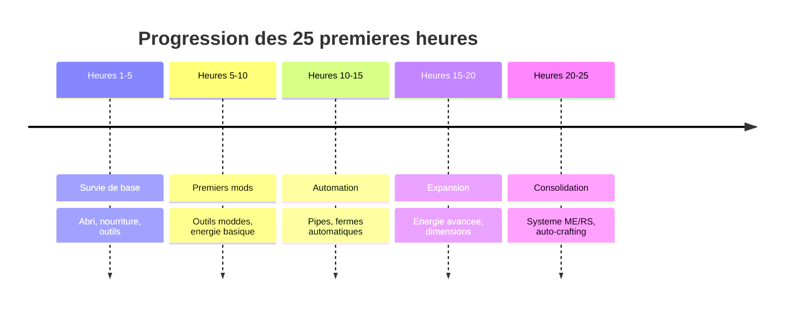

# Guide des 25 Premieres Heures

!!! abstract "Vue d'ensemble"
    Ce guide vous accompagne dans vos **25 premieres heures** de jeu sur n'importe quel modpack Minecraft.
    Suivez cette progression structuree pour etablir une base solide et decouvrir les mecaniques essentielles.

---

## Apercu de la Progression



<div class="grid cards" markdown>

-   :material-shield-home: **Phase 1 - Survie**

    ---

    **Heures 1-5** | Difficulte : -

    Etablir une base securisee avec abri, nourriture et outils de base.

-   :material-wrench: **Phase 2 - Premiers Mods**

    ---

    **Heures 5-10** | Difficulte : --

    Decouvrir les outils moddes et l'energie basique.

-   :material-cog: **Phase 3 - Automation**

    ---

    **Heures 10-15** | Difficulte : ---

    Automatiser les taches repetitives avec pipes et fermes.

-   :material-rocket-launch: **Phase 4 - Expansion**

    ---

    **Heures 15-20** | Difficulte : ----

    Etendre vos capacites avec energie avancee et dimensions.

-   :material-check-all: **Phase 5 - Consolidation**

    ---

    **Heures 20-25** | Difficulte : -----

    Optimiser et organiser avec systeme ME/RS et auto-crafting.

</div>

---

## Progression Detaillee

=== ":material-shield-home: Heures 1-5 : Survie de Base"

    !!! tip "Objectif Principal"
        Etablir les fondations de votre survie : abri securise, nourriture stable, et outils de base.

    ---

    ### :dart: Objectifs Principaux

    1. Construire un abri temporaire (au moins 5x5)
    2. Securiser une source de nourriture
    3. Crafter un set d'outils complet (fer minimum)
    4. Explorer JEI et comprendre les recettes
    5. Trouver les guides Patchouli des mods
    6. Mettre en place le premier ore doubling
    7. Obtenir un backpack ou expansion d'inventaire

    ---

    ### :package: Mods a Explorer

    | Mod                                              | Utilite                                                   | Priorite              |
    |:-------------------------------------------------|:----------------------------------------------------------|:----------------------|
    | :mag: **JEI**                                    | Recherche de recettes (**`R`** / **`U`**)                 | - **Essentiel**  |
    | :book: **Patchouli**                             | Guides in-game des mods                                   | - **Essentiel**  |
    | :school_satchel: **Sophisticated Backpacks**    | Extension d'inventaire                                    | :arrow_up: Haute      |
    | :hammer_and_wrench: **Tinkers' Construct**       | Outils ameliorables                                       | :arrow_up: Haute      |
    | :cook: **Cooking for Blockheads**                | Cuisine simplifiee                                        | :arrow_right: Moyenne |

    ---

    ### :hammer: Items a Crafter

    !!! example "Crafts Prioritaires"

        === "Outils de base"

            | Item                          | Description                    |
            |:------------------------------|:-------------------------------|
            | :pick: Pioche en fer          | Ou equivalent modde            |
            | :axe: Hache en fer            | Pour le bois                   |
            | :spade: Pelle en fer          | Pour la terre/gravier          |
            | :crossed_swords: Epee en fer  | Protection contre les mobs     |

        === "Survie"

            | Item                    | Quantite          |
            |:------------------------|:------------------|
            | :bed: Lit               | 1                 |
            | :candle: Torches        | 64+               |
            | :package: Coffres       | 10+               |
            | :bucket: Seaux          | 3 minimum         |

        === "Premier Ore Doubling"

            - Four vanilla **OU**
            - Pulverizer / Crusher basique
            - Grindstone (:hammer_and_wrench: Tinkers' / :factory: Create)

    ---

    ### :bulb: Tips Specifiques

    !!! warning "Erreurs Courantes a Eviter"
        - **Ne pas ignorer les guides Patchouli** - ils contiennent des infos cruciales
        - **Ne pas miner sans torches** - le spawn de mobs vous ralentira
        - **Ne pas negliger la nourriture** - la faim reduit votre efficacite

    !!! success "Astuces Efficaces"

        | Astuce                | Description                                               |
        |:----------------------|:----------------------------------------------------------|
        | **JEI Bookmarks**     | Appuyez sur **`A`** pour sauvegarder des recettes         |
        | **Bed hop**           | Dormez des que possible pour eviter les mobs              |
        | **Charbon**           | Priorite aux veines de charbon pour les torches           |
        | **Fer**               | Gardez 32+ lingots pour l'ore doubling                    |

    ---

    ### :clipboard: Checklist Phase 1

    | #   | Tache                              | A faire                          |
    |:---:|:-----------------------------------|:---------------------------------|
    | 1   | Abri securise construit            | :material-checkbox-blank-outline: |
    | 2   | Lit place                          | :material-checkbox-blank-outline: |
    | 3   | 64+ torches craftees               | :material-checkbox-blank-outline: |
    | 4   | Source de nourriture stable        | :material-checkbox-blank-outline: |
    | 5   | Outils fer complets                | :material-checkbox-blank-outline: |
    | 6   | JEI maitrise (**`R`**/**`U`**/**`A`**) | :material-checkbox-blank-outline: |
    | 7   | Guides Patchouli trouves           | :material-checkbox-blank-outline: |
    | 8   | Premier ore doubling actif         | :material-checkbox-blank-outline: |
    | 9   | Backpack ou equivalent obtenu      | :material-checkbox-blank-outline: |

---

=== ":material-wrench: Heures 5-10 : Premiers Mods"

    !!! tip "Objectif Principal"
        Decouvrir et utiliser vos premiers outils moddes, etablir un systeme de transport et une source d'energie basique.

    ---

    ### :dart: Objectifs Principaux

    1. Crafter des outils :hammer_and_wrench: Tinkers' ou Silent Gear
    2. Placer des Waystones strategiques
    3. Construire un generateur basique (furnace generator)
    4. Creer une premiere mob farm simple
    5. Organiser le stockage avec labels/categories

    ---

    ### :package: Mods a Explorer

    | Mod                                              | Utilite                           | Priorite              |
    |:-------------------------------------------------|:----------------------------------|:----------------------|
    | :hammer_and_wrench: **Tinkers' Construct**       | Outils personnalisables           | - **Essentiel**  |
    | :tools: **Silent Gear**                          | Alternative a Tinkers'            | - **Essentiel**  |
    | :milky_way: **Waystones**                        | Teleportation rapide              | :arrow_up: Haute      |
    | :shield: **FTB Utilities**                       | Claims et homes                   | :arrow_up: Haute      |
    | :gear: **Mekanism** / :fire: **Thermal**         | Energie et machines               | :arrow_up: Haute      |
    | :skull: **Mob Grinding Utils**                   | Mob farms faciles                 | :arrow_right: Moyenne |

    ---

    ### :hammer: Items a Crafter

    !!! example "Crafts Prioritaires"

        === "Outils Moddes"

            | Item                          | Description                        |
            |:------------------------------|:-----------------------------------|
            | :pick: Pioche Tinkers'        | Cobalt tip si possible             |
            | :hammer: Hammer/Excavator     | Pour minage rapide                 |
            | :evergreen_tree: Lumber Axe   | Pour arbres entiers                |
            | :crossed_swords: Epee Looting | Bonus de drop                      |

        === "Transport"

            | Item                          | Quantite / Notes                   |
            |:------------------------------|:-----------------------------------|
            | :milky_way: Waystones         | 3-5 strategiquement places         |
            | :athletic_shoe: Step Boots    | Boots avec step assist             |
            | :parachute: Glider            | Ou parachute pour descentes        |

        === "Energie"

            | Item                          | Description                        |
            |:------------------------------|:-----------------------------------|
            | :fire: Furnace Generator      | Source d'energie initiale          |
            | :electric_plug: Cables        | Conduits basiques                  |
            | :battery: Energy Cell         | Stockage d'energie                 |

        === "Mob Farm"

            | Composant                     | Specification                      |
            |:------------------------------|:-----------------------------------|
            | Spawner Room                  | 9x9 minimum                        |
            | Systeme de Kill               | Fall damage ou lava                |
            | Collecte                      | Hoppers ou pipes                   |

    ---

    ### :bulb: Tips Specifiques

    !!! info "Tinkers' vs Silent Gear"

        | Aspect          | :hammer_and_wrench: Tinkers' Construct | :tools: Silent Gear       |
        |:----------------|:---------------------------------------|:--------------------------|
        | **Complexite**  | Moyenne                                | Faible                    |
        | **Upgrades**    | Modifiers limites                      | Traits empilables         |
        | **Reparation**  | Station requise                        | Anvil vanilla             |
        | **Disponibilite** | Packs tech                           | Packs varies              |

        **Conseil** : Choisissez celui present dans votre pack et maitrisez-le.

    !!! success "Astuces Efficaces"

        | Astuce              | Description                                                        |
        |:--------------------|:-------------------------------------------------------------------|
        | **Waystones**       | Placez-en a la base, au spawn, et aux biomes cles                  |
        | **Furnace Gen**     | 1 charbon = beaucoup de RF, economique au debut                    |
        | **Mob Farm**        | Commencez simple - dark room + eau + lava blade suffit             |
        | **Storage**         | Utilisez des panneaux ou Item Frames pour identifier les coffres   |

    !!! warning "Pieges a Eviter"
        - **Ne pas over-engineer** la mob farm - simple est mieux au debut
        - **Ne pas gaspiller** les ressources sur des machines tier 1 inutiles
        - **Ne pas oublier** de claim votre base (griefing/protection)

    ---

    ### :clipboard: Checklist Phase 2

    | #   | Tache                                    | A faire                          |
    |:---:|:-----------------------------------------|:---------------------------------|
    | 1   | Outil Tinkers'/Silent Gear crafte        | :material-checkbox-blank-outline: |
    | 2   | 3+ Waystones placees                     | :material-checkbox-blank-outline: |
    | 3   | Furnace Generator fonctionnel            | :material-checkbox-blank-outline: |
    | 4   | Cables d'energie installes               | :material-checkbox-blank-outline: |
    | 5   | Mob farm basique operationnelle          | :material-checkbox-blank-outline: |
    | 6   | Stockage organise par categorie          | :material-checkbox-blank-outline: |
    | 7   | Base claimee/protegee                    | :material-checkbox-blank-outline: |
    | 8   | Home set configure                       | :material-checkbox-blank-outline: |

---

=== ":material-cog: Heures 10-15 : Automation Basique"

    !!! tip "Objectif Principal"
        Automatiser les taches repetitives : smelting, farming, et collecte de ressources.

    ---

    ### :dart: Objectifs Principaux

    1. Installer un systeme de pipes/conduits
    2. Automatiser le smelting (auto-smelt)
    3. Creer une crop farm automatique
    4. Mettre en place une tree farm
    5. Implementer un systeme de stockage (:floppy_disk: AE2 / RS / Drawers)

    ---

    ### :package: Mods a Explorer

    | Mod                                              | Utilite                           | Priorite              |
    |:-------------------------------------------------|:----------------------------------|:----------------------|
    | :gear: **Pipez / XNet / Mekanism Pipes**         | Transport d'items                 | - **Essentiel**  |
    | :file_cabinet: **Storage Drawers**               | Stockage bulk                     | - **Essentiel**  |
    | :floppy_disk: **Applied Energistics 2**          | Systeme ME                        | :arrow_up: Haute      |
    | :cd: **Refined Storage**                         | Alternative a AE2                 | :arrow_up: Haute      |
    | :tractor: **Industrial Foregoing**               | Farming automatique               | :arrow_up: Haute      |
    | :factory: **Create**                             | Automation mecanique              | :arrow_right: Moyenne |

    ---

    ### :hammer: Items a Crafter

    !!! example "Crafts Prioritaires"

        === "Systeme de Pipes"

            | Item                          | Quantite / Notes                   |
            |:------------------------------|:-----------------------------------|
            | Pipes/conduits basiques       | 64+                                |
            | Servos/extracteurs            | Pour sortir les items              |
            | Filtres d'items               | Pour router correctement           |
            | Speed upgrades                | Acceleration optionnelle           |

        === "Auto-Smelting"

            | Item                          | Description                        |
            |:------------------------------|:-----------------------------------|
            | Powered Furnace               | Ou Alloy Smelter                   |
            | Input/Output                  | Hoppers ou pipes                   |
            | Speed Upgrade                 | Acceleration du smelting           |

        === "Crop Farm"

            | Composant                     | Specification                      |
            |:------------------------------|:-----------------------------------|
            | Farmer block                  | Industrial Foregoing ou similaire  |
            | Zone de culture               | 9x9 minimum                        |
            | Auto-replant                  | Active                             |
            | Collecte                      | Vers stockage central              |

        === "Tree Farm"

            | Composant                     | Description                        |
            |:------------------------------|:-----------------------------------|
            | Mechanical User               | Ou Axe block                       |
            | Sapling replanter             | Automatique                        |
            | Leaf destroyer                | Optionnel mais recommande          |

        === "Stockage Intermediaire"

            | Item                          | Description                        |
            |:------------------------------|:-----------------------------------|
            | Storage Drawers               | 2x2 et 1x1                         |
            | Drawer Controller             | Point d'acces central              |
            | Compacting Drawers            | Conversion auto ingot/block        |
            | Void Upgrade                  | Trash overflow                     |

    ---

    ### :bulb: Tips Specifiques

    !!! info "Comparaison Systemes de Stockage"

        | Systeme                        | Complexite | Capacite    | Recherche | Ideal Pour        |
        |:-------------------------------|:-----------|:------------|:----------|:------------------|
        | :file_cabinet: **Drawers**     | Faible     | Moyenne     | Non       | Bulk items        |
        | :cd: **Refined Storage**       | Moyenne    | Haute       | Oui       | Debutants         |
        | :floppy_disk: **AE2**          | Haute      | Tres Haute  | Oui       | Long terme        |
        | :jigsaw: **Hybrid**            | Variable   | Maximale    | Oui       | Optimal           |

        **Recommandation** : Drawers maintenant, RS/AE2 plus tard.

    !!! success "Astuces Efficaces"

        | Astuce              | Description                                                        |
        |:--------------------|:-------------------------------------------------------------------|
        | **Pipe Priority**   | Utilisez les priorites pour router les items correctement          |
        | **Overflow**        | Toujours prevoir un void/trash pour eviter les jams                |
        | **Compacting**      | Les Compacting Drawers convertissent auto (ingot <-> block)        |
        | **Labels**          | Verrouillez les drawers avec un item pour eviter le melange        |

    !!! example "Layout Farm Efficace (9x9 = 80 crops)"

        **Legende :** `S` = Soil/Crop | `W` = Water | `F` = Farmer

        ```
        +---+---+---+---+---+---+---+---+---+
        | S | S | S | S | S | S | S | S | S |
        +---+---+---+---+---+---+---+---+---+
        | S | S | S | S | S | S | S | S | S |
        +---+---+---+---+---+---+---+---+---+
        | S | S | S | S | S | S | S | S | S |
        +---+---+---+---+---+---+---+---+---+
        | S | S | S | W | F | W | S | S | S |
        +---+---+---+---+---+---+---+---+---+
        | S | S | S | S | S | S | S | S | S |
        +---+---+---+---+---+---+---+---+---+
        | S | S | S | S | S | S | S | S | S |
        +---+---+---+---+---+---+---+---+---+
        | S | S | S | S | S | S | S | S | S |
        +---+---+---+---+---+---+---+---+---+
        ```

        **Output** vers Storage Drawers avec Drawer Controller

    ---

    ### :clipboard: Checklist Phase 3

    | #   | Tache                                    | A faire                          |
    |:---:|:-----------------------------------------|:---------------------------------|
    | 1   | Systeme de pipes installe                | :material-checkbox-blank-outline: |
    | 2   | Auto-smelting fonctionnel                | :material-checkbox-blank-outline: |
    | 3   | Crop farm 9x9+ automatique               | :material-checkbox-blank-outline: |
    | 4   | Tree farm operationnelle                 | :material-checkbox-blank-outline: |
    | 5   | Storage Drawers configures               | :material-checkbox-blank-outline: |
    | 6   | Drawer Controller connecte               | :material-checkbox-blank-outline: |
    | 7   | Overflow/Void en place                   | :material-checkbox-blank-outline: |
    | 8   | Toutes les fermes reliees                | :material-checkbox-blank-outline: |

---

=== ":material-rocket-launch: Heures 15-20 : Expansion"

    !!! tip "Objectif Principal"
        Etendre vos capacites : meilleure energie, processing avance, exploration de mods magiques, et preparation aux dimensions.

    ---

    ### :dart: Objectifs Principaux

    1. Upgrader vers une meilleure source d'energie
    2. Ameliorer le ore processing (3x/4x)
    3. Explorer un mod magique (:herb: Botania / Blood Magic / etc)
    4. Obtenir le vol (jetpack ou Angel Ring)
    5. Preparer l'exploration du Nether/autres dimensions

    ---

    ### :package: Mods a Explorer

    | Mod                                              | Utilite                           | Priorite              |
    |:-------------------------------------------------|:----------------------------------|:----------------------|
    | :gear: **Mekanism**                              | Ore 5x, energie                   | - **Essentiel**  |
    | :fire: **Thermal Series**                        | Machines polyvalentes             | :arrow_up: Haute      |
    | :herb: **Botania**                               | Magie naturelle                   | :arrow_up: Haute      |
    | :drop_of_blood: **Blood Magic**                  | Magie de sang                     | :arrow_right: Moyenne |
    | :sparkles: **Ars Nouveau**                       | Spellcasting                      | :arrow_right: Moyenne |
    | :rocket: **Simply Jetpacks**                     | Vol                               | :arrow_up: Haute      |

    ---

    ### :hammer: Items a Crafter

    !!! example "Crafts Prioritaires"

        === "Energie Avancee"

            | Item                          | Description                        |
            |:------------------------------|:-----------------------------------|
            | Big Reactor                   | Ou :gear: Mekanism Reactor         |
            | Solar Panels tier 2+          | Energie passive                    |
            | Energy Storage                | Millions RF+ de capacite           |
            | Cables haute capacite         | Pour transfert rapide              |

        === "Ore Processing"

            | Item                          | Description                        |
            |:------------------------------|:-----------------------------------|
            | Enrichment Chamber            | :gear: Mekanism                    |
            | Purification Chamber          | :gear: Mekanism                    |
            | Energized Smelter             | :gear: Mekanism                    |
            | Chemical Systems              | Pour le 5x ore processing          |

        === "Vol"

            | Item                          | Source / Notes                     |
            |:------------------------------|:-----------------------------------|
            | :rocket: Jetpack              | Simply Jetpacks                    |
            | :angel: Angel Ring            | Extra Utilities                    |
            | Creative Flight item          | Si disponible dans le pack         |
            | Elytra + Fireworks            | Backup vanilla                     |

        === "Magie (Botania)"

            | Item                          | Description                        |
            |:------------------------------|:-----------------------------------|
            | :herb: Mana Pool              | Stockage de mana                   |
            | Mana Spreader                 | Transport de mana                  |
            | Generating Flora              | Endoflame, etc                     |
            | Functional Flora              | Utilitaires varies                 |

    ---

    ### :bulb: Tips Specifiques

    !!! info "Comparaison Options de Vol"

        | Item                          | Vitesse  | Fuel | Difficulte     | Recommande Pour   |
        |:------------------------------|:---------|:-----|:---------------|:------------------|
        | :rocket: **Jetpack T1**       | Lente    | Oui  | Facile         | Early game        |
        | :rocket: **Jetpack T4**       | Rapide   | Oui  | Moyen          | Mid game          |
        | :angel: **Angel Ring**        | Moyenne  | Non  | Difficile      | Long terme        |
        | :star2: **Creative Flight**   | Variable | Non  | Tres Difficile | End game          |

    !!! success "Astuces Efficaces"

        | Astuce                | Description                                                        |
        |:----------------------|:-------------------------------------------------------------------|
        | **Mekanism 5x**       | Investissez tot, le ROI est enorme                                 |
        | **Botania**           | Commencez par les Endoflames, simples et efficaces                 |
        | **Nether**            | Apportez Waystones, eau (cauldron), et blocs de construction       |
        | **Jetpack**           | Gardez toujours du fuel de secours                                 |

    !!! warning "Preparation Dimensions"

        === ":fire: Nether Essentials"

            | Item                          | Quantite / Notes                   |
            |:------------------------------|:-----------------------------------|
            | Fire Resistance potions       | 8+ minutes                         |
            | Golden apples                 | 4+                                 |
            | Blocks de construction        | Cobble 128+                        |
            | Waystone portable             | Ou bed                             |
            | Pickaxe efficace              | Efficiency 4+                      |
            | Bucket of water               | Cauldron pour placer               |

        === ":dragon: End Prep"

            | Item                          | Quantite / Notes                   |
            |:------------------------------|:-----------------------------------|
            | Ender pearls                  | 12+                                |
            | Slow falling potions          | Plusieurs                          |
            | Bow Power/Infinity            | Pour le dragon                     |
            | Pumpkin head                  | Optionnel (Endermen)               |

    ---

    ### :clipboard: Checklist Phase 4

    | #   | Tache                                    | A faire                          |
    |:---:|:-----------------------------------------|:---------------------------------|
    | 1   | Energie 100k+ RF/t disponible            | :material-checkbox-blank-outline: |
    | 2   | Ore processing 3x+ actif                 | :material-checkbox-blank-outline: |
    | 3   | Vol obtenu et fonctionnel                | :material-checkbox-blank-outline: |
    | 4   | Mod magique debute                       | :material-checkbox-blank-outline: |
    | 5   | Nether explore                           | :material-checkbox-blank-outline: |
    | 6   | Ressources Nether stockees               | :material-checkbox-blank-outline: |
    | 7   | Waystone Nether placee                   | :material-checkbox-blank-outline: |
    | 8   | Dimension prep complete                  | :material-checkbox-blank-outline: |

---

=== ":material-check-all: Heures 20-25 : Consolidation"

    !!! tip "Objectif Principal"
        Consolider vos systemes : stockage centralise, auto-crafting, enchantement, et organisation finale de la base.

    ---

    ### :dart: Objectifs Principaux

    1. Installer un systeme ME ou RS complet
    2. Configurer l'auto-crafting
    3. Creer un setup d'enchantement optimise
    4. Upgrader la mob farm
    5. Organiser et decorer la base

    ---

    ### :package: Mods a Explorer

    | Mod                                              | Utilite                           | Priorite              |
    |:-------------------------------------------------|:----------------------------------|:----------------------|
    | :floppy_disk: **Applied Energistics 2**          | Stockage digital ME               | - **Essentiel**  |
    | :cd: **Refined Storage**                         | Alternative RS                    | - **Essentiel**  |
    | :sparkles: **Apotheosis**                        | Enchantements ameliores           | :arrow_up: Haute      |
    | :tractor: **Industrial Foregoing**               | Mob farm avancee                  | :arrow_up: Haute      |
    | :dragon: **Draconic Evolution**                  | End game                          | :arrow_right: Moyenne |

    ---

    ### :hammer: Items a Crafter

    !!! example "Crafts Prioritaires"

        === "Systeme ME/RS"

            | Item                          | Description                        |
            |:------------------------------|:-----------------------------------|
            | ME/RS Controller              | Coeur du systeme                   |
            | Drives + Storage Cells        | 64k+ recommande                    |
            | ME Terminal / Grid            | Interface utilisateur              |
            | Crafting CPU / Crafter        | Pour auto-crafting                 |
            | Import/Export Bus             | Automation entree/sortie           |
            | Interface                     | Connexion machines                 |

        === "Auto-Crafting"

            | Item                          | Description                        |
            |:------------------------------|:-----------------------------------|
            | Patterns                      | Encode les recettes                |
            | Crafting CPUs                 | Multi-block pour parallelisme      |
            | Pattern Provider              | Ou Interface                       |
            | Molecular Assembler           | Execute les crafts                 |

        === "Enchanting Setup"

            | Item                          | Description                        |
            |:------------------------------|:-----------------------------------|
            | Enchanting table              | Max level                          |
            | Bookshelves                   | 15+ (ou Apotheosis shelves)        |
            | Disenchanter                  | Recuperer enchants                 |
            | Anvil auto-repair             | Si disponible                      |
            | XP storage/fluid              | Stockage experience                |

        === "Mob Farm Upgrade"

            | Item                          | Description                        |
            |:------------------------------|:-----------------------------------|
            | Mob Crusher                   | Industrial Foregoing               |
            | Looting upgrade               | Bonus de drops                     |
            | XP collection                 | Vers stockage                      |
            | Cursed Earth                  | Ou similaire pour spawn rate       |

    ---

    ### :bulb: Tips Specifiques

    !!! info "ME vs RS - Choix Final"

        | Aspect                        | :floppy_disk: Applied Energistics 2 | :cd: Refined Storage    |
        |:------------------------------|:------------------------------------|:------------------------|
        | **Setup**                     | Channels, complexe                  | Simple, no channels     |
        | **Puissance**                 | Tres haute                          | Haute                   |
        | **Courbe d'apprentissage**    | Difficile                           | Facile                  |
        | **Auto-Crafting**             | Tres flexible                       | Flexible                |
        | **Recommande**                | Experts                             | Debutants/Mid           |

    !!! success "Astuces Auto-Crafting"

        | Astuce                | Description                                                        |
        |:----------------------|:-------------------------------------------------------------------|
        | **Patterns**          | Creez des patterns pour TOUS les items frequents                   |
        | **Sub-crafting**      | Les patterns peuvent appeler d'autres patterns                     |
        | **CPU Size**          | Plus de CPUs = crafts paralleles                                   |
        | **Interface+Drawers** | Combo puissant pour bulk crafting                                  |

    !!! example "Layout Enchanting Optimal"

        **Legende :** `E` = Enchanting Table | `B` = Bookshelves (15 min) | `A` = Anvil

        ```
        +---+---+---+---+---+
        | B | B | B | B | B |
        +---+---+---+---+---+
        | B |   |   |   | B |
        +---+---+---+---+---+
        | B |   | E |   | B |
        +---+---+---+---+---+
        | B |   |   |   | B |
        +---+---+---+---+---+
        | B | B | B | B | B |
        +---+---+---+---+---+
        ```

        + :sparkles: Apotheosis shelves pour bonus supplementaires
        + Anvil a proximite pour combiner enchants

    !!! warning "Organisation Base - Zones Recommandees"

        | Zone                          | Contenu                            | Distance ME             |
        |:------------------------------|:-----------------------------------|:------------------------|
        | :house: **Central**           | ME/RS, Crafting                    | Core                    |
        | :zap: **Power**               | Generateurs, stockage              | 10-20 blocks            |
        | :gear: **Processing**         | Ore, smelting                      | Connecte                |
        | :seedling: **Farming**        | Crops, mobs, arbres                | Peut etre distant       |
        | :file_cabinet: **Storage Bulk** | Drawers overflow                 | Connecte                |
        | :sparkles: **Enchanting**     | Table, anvil, XP                   | Proche                  |

    ---

    ### :clipboard: Checklist Phase 5

    | #   | Tache                                    | A faire                          |
    |:---:|:-----------------------------------------|:---------------------------------|
    | 1   | Systeme ME/RS installe                   | :material-checkbox-blank-outline: |
    | 2   | 1M+ items de stockage                    | :material-checkbox-blank-outline: |
    | 3   | Auto-crafting configure                  | :material-checkbox-blank-outline: |
    | 4   | Patterns essentiels encodes              | :material-checkbox-blank-outline: |
    | 5   | Enchanting setup optimise                | :material-checkbox-blank-outline: |
    | 6   | Mob farm avec looting/XP                 | :material-checkbox-blank-outline: |
    | 7   | Base organisee par zones                 | :material-checkbox-blank-outline: |
    | 8   | Energie stable et suffisante             | :material-checkbox-blank-outline: |

---

## :trophy: Checklist Recapitulatif Global

!!! abstract "Progression Complete - 25 Heures"

    Utilisez cette checklist pour suivre votre progression globale a travers les 5 phases.

---

### :material-shield-home: Phase 1 : Survie (Heures 1-5)

| #   | Tache                                    | Status                           |
|:---:|:-----------------------------------------|:---------------------------------|
| 1   | Abri securise                            | :material-checkbox-blank-outline: |
| 2   | Source de nourriture                     | :material-checkbox-blank-outline: |
| 3   | Outils fer complets                      | :material-checkbox-blank-outline: |
| 4   | JEI maitrise                             | :material-checkbox-blank-outline: |
| 5   | Guides Patchouli trouves                 | :material-checkbox-blank-outline: |
| 6   | Premier ore doubling                     | :material-checkbox-blank-outline: |
| 7   | Backpack obtenu                          | :material-checkbox-blank-outline: |

---

### :material-wrench: Phase 2 : Premiers Mods (Heures 5-10)

| #   | Tache                                    | Status                           |
|:---:|:-----------------------------------------|:---------------------------------|
| 8   | Outils Tinkers'/Silent Gear              | :material-checkbox-blank-outline: |
| 9   | Waystones placees                        | :material-checkbox-blank-outline: |
| 10  | Furnace Generator                        | :material-checkbox-blank-outline: |
| 11  | Mob farm basique                         | :material-checkbox-blank-outline: |
| 12  | Stockage organise                        | :material-checkbox-blank-outline: |

---

### :material-cog: Phase 3 : Automation (Heures 10-15)

| #   | Tache                                    | Status                           |
|:---:|:-----------------------------------------|:---------------------------------|
| 13  | Systeme de pipes                         | :material-checkbox-blank-outline: |
| 14  | Auto-smelting                            | :material-checkbox-blank-outline: |
| 15  | Crop farm automatique                    | :material-checkbox-blank-outline: |
| 16  | Tree farm                                | :material-checkbox-blank-outline: |
| 17  | Storage Drawers setup                    | :material-checkbox-blank-outline: |

---

### :material-rocket-launch: Phase 4 : Expansion (Heures 15-20)

| #   | Tache                                    | Status                           |
|:---:|:-----------------------------------------|:---------------------------------|
| 18  | Energie avancee                          | :material-checkbox-blank-outline: |
| 19  | Ore processing 3x+                       | :material-checkbox-blank-outline: |
| 20  | Vol obtenu                               | :material-checkbox-blank-outline: |
| 21  | Mod magique debute                       | :material-checkbox-blank-outline: |
| 22  | Nether explore                           | :material-checkbox-blank-outline: |

---

### :material-check-all: Phase 5 : Consolidation (Heures 20-25)

| #   | Tache                                    | Status                           |
|:---:|:-----------------------------------------|:---------------------------------|
| 23  | Systeme ME/RS complet                    | :material-checkbox-blank-outline: |
| 24  | Auto-crafting fonctionnel                | :material-checkbox-blank-outline: |
| 25  | Enchanting setup                         | :material-checkbox-blank-outline: |
| 26  | Mob farm upgradee                        | :material-checkbox-blank-outline: |
| 27  | Base organisee                           | :material-checkbox-blank-outline: |

---

## :bulb: Conseils Finaux

!!! tip "Cles du Succes"

    | #   | Conseil                                  | Description                                    |
    |:---:|:-----------------------------------------|:-----------------------------------------------|
    | 1   | **Ne pas rusher**                        | Chaque phase construit sur la precedente       |
    | 2   | **Lire les guides**                      | Les manuels Patchouli sont vos amis            |
    | 3   | **Automatiser tot**                      | Le temps investi est recupere x10              |
    | 4   | **Backup reguliers**                     | Sauvegardez votre monde                        |
    | 5   | **Experimenter**                         | Chaque modpack est unique                      |

!!! quote "Rappel Important"
    Ce guide est une **feuille de route**, pas une regle stricte.
    Adaptez-le a votre modpack specifique et a votre style de jeu.
    L'important est de **progresser** et de **s'amuser** !

---

*Derniere mise a jour : Guide universel compatible avec la majorite des modpacks 1.16+*
