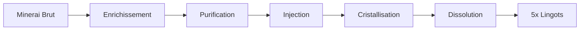
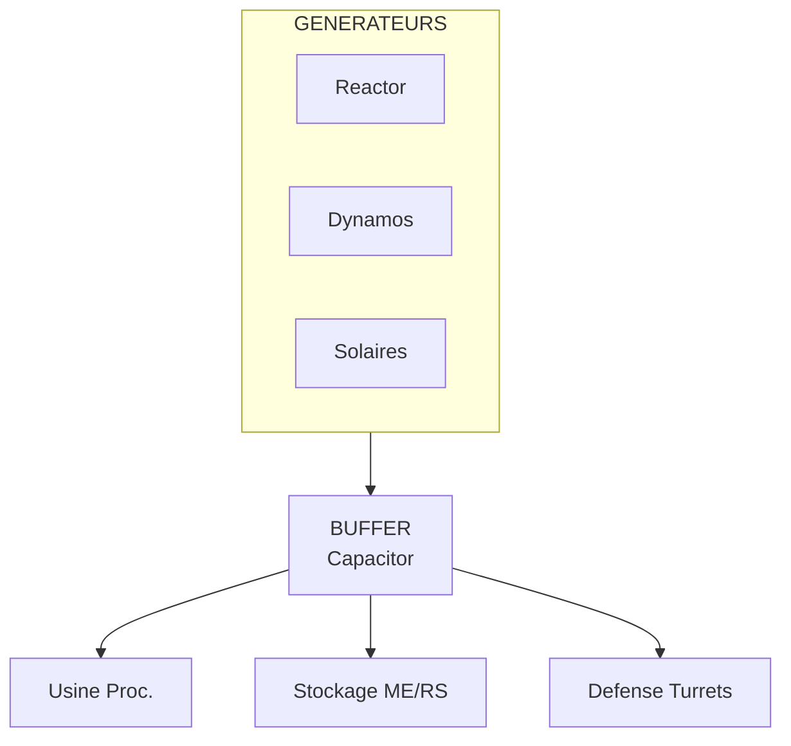

# Guide Mid-Game (10-50h)

!!! info "Phase de Transition"
    Le mid-game est la phase où vous passez d'une base manuelle à une infrastructure **automatisée**. C'est le moment de construire les fondations de votre empire industriel et magique.

---

## Vue d'Ensemble des Objectifs Mid-Game

| Priorité | Objectif | Difficulté | Impact |
|:--------:|----------|:----------:|:------:|
| :material-star: :material-star: :material-star: | Automatiser le transport d'items | Moyenne | Très élevé |
| :material-star: :material-star: :material-star: | Système de stockage centralisé | Moyenne | Très élevé |
| :material-star: :material-star: :material-star: | Production d'énergie stable | Moyenne | Critique |
| :material-star: :material-star: | Ore processing avancé | Élevée | Élevé |
| :material-star: :material-star: | Première machine d'extraction auto | Élevée | Élevé |
| :material-star: | Progression magique | Variable | Moyen |

---

## Automatisation

### Transport d'Items

!!! tip "Conseil de Pro"
    Commencez simple avec un mod, maîtrisez-le, puis explorez les alternatives.

=== "🌡️ Thermal Dynamics"

    | Composant | Utilisation | Recette de base |
    |:----------|:------------|:----------------|
    | Itemduct | Transport d'items | Étain + Verre |
    | Servo | Extraction | Redstone + Fer |
    | Filter | Filtrage | Papier + Fer |
    | Retriever | Demande d'items | Ender Pearl + Or |

    **Configuration recommandée:**

    ```mermaid
    flowchart LR
        A[Coffre Source] -->|Servo + Itemduct| B[Machine Cible]
    ```

=== "⚗️ Mekanism"

    | Composant | Utilisation | Avantage |
    |:----------|:------------|:---------|
    | Logistical Transporter | Transport universel | Très rapide |
    | Logistical Sorter | Tri intelligent | Auto-éjection |
    | Bin | Stockage en ligne | Grande capacité |

    !!! note "Vitesse"
        Les transporteurs Mekanism sont parmi les plus rapides du jeu.

=== "🔧 Pretty Pipes"

    | Composant | Utilisation | Simplicité |
    |:----------|:------------|:-----------|
    | Pipe | Transport de base | Très simple |
    | Extraction Module | Extraction | Low/Mid/High tiers |
    | Filter Module | Filtrage | Tags supportés |
    | Crafting Module | Auto-craft basique | Sans contrôleur |

=== "🌐 XNet"

    | Composant | Utilisation | Puissance |
    |:----------|:------------|:----------|
    | Controller | Cerveau du réseau | 8 canaux |
    | Connector | Connexion machines | Multi-type |
    | Cable | Liaison | Items/Fluides/Énergie |

    !!! warning "Courbe d'Apprentissage"
        XNet est puissant mais nécessite du temps pour maîtriser son interface.

---

### Systèmes d'Auto-Crafting

=== "🔨 RFTools Crafter"

    **Tier 1 - Crafter1**

    | Caractéristique | Valeur |
    |:----------------|:-------|
    | Recettes | 2 |
    | Vitesse | Lente |
    | Coût RF | Faible |

    **Tier 2 - Crafter2**

    | Caractéristique | Valeur |
    |:----------------|:-------|
    | Recettes | 4 |
    | Vitesse | Moyenne |
    | Coût RF | Moyen |

    **Tier 3 - Crafter3**

    | Caractéristique | Valeur |
    |:----------------|:-------|
    | Recettes | 8 |
    | Vitesse | Rapide |
    | Coût RF | Élevé |

=== "🌡️ Thermal Expansion"

    | Machine | Fonction | Upgrades |
    |:--------|:---------|:---------|
    | Sequential Fabricator | Crafting automatique | Augments disponibles |
    | Redstone Furnace | Smelting auto | Speed/Energy augments |

=== "⚙️ Create"

    | Composant | Fonction |
    |:----------|:---------|
    | Mechanical Crafter | Crafting rotatif |
    | Deployer | Utilisation d'items |
    | Spout | Remplissage fluides |

    !!! info "Pas d'Énergie RF"
        Create utilise la rotation (SU) au lieu de RF.

---

### Chaînes de Processing



---

## Progression du Stockage

### De Coffres vers ME/RS

| Phase | Solution | Capacité | Complexité |
|:-----:|:---------|:---------|:-----------|
| 1 | Coffres basiques | ~27 stacks/coffre | Très faible |
| 2 | 📦 Iron Chests | ~108 stacks/coffre | Faible |
| 3 | 🗄️ Storage Drawers | Illimité (upgrades) | Moyenne |
| 4 | 💾 RS/ME System | Millions d'items | Élevée |

=== "💠 Applied Energistics 2 (ME)"

    **Composants essentiels:**

    | Composant | Fonction | Priorité |
    |:----------|:---------|:--------:|
    | ME Controller | Cerveau du réseau | :material-star: :material-star: :material-star: |
    | ME Drive | Stocke les cellules | :material-star: :material-star: :material-star: |
    | ME Terminal | Accès aux items | :material-star: :material-star: :material-star: |
    | Crafting Terminal | Accès + craft | :material-star: :material-star: |
    | Import/Export Bus | Connexion externe | :material-star: :material-star: |
    | Storage Bus | Accès coffres externes | :material-star: :material-star: |

    !!! warning "Énergie Requise"
        Un système ME consomme beaucoup d'énergie. Prévoyez **minimum 500 RF/t** pour un petit système.

    **Cellules de stockage:**

    | Cellule | Capacité Types | Capacité Items |
    |:--------|:--------------:|:--------------:|
    | 1k | 63 types | 8,128 items |
    | 4k | 63 types | 32,512 items |
    | 16k | 63 types | 130,048 items |
    | 64k | 63 types | 520,192 items |

=== "💿 Refined Storage (RS)"

    **Composants essentiels:**

    | Composant | Fonction | Priorité |
    |:----------|:---------|:--------:|
    | Controller | Cerveau du réseau | :material-star: :material-star: :material-star: |
    | Disk Drive | Stocke les disques | :material-star: :material-star: :material-star: |
    | Grid | Accès aux items | :material-star: :material-star: :material-star: |
    | Crafting Grid | Accès + craft | :material-star: :material-star: |
    | Importer/Exporter | Connexion externe | :material-star: :material-star: |
    | External Storage | Accès coffres | :material-star: :material-star: |

    !!! tip "Plus Simple que ME"
        Refined Storage n'a pas besoin de channels, ce qui le rend plus accessible.

    **Disques de stockage:**

    | Disque | Capacité |
    |:-------|:--------:|
    | 1k | 1,000 items |
    | 4k | 4,000 items |
    | 16k | 16,000 items |
    | 64k | 64,000 items |

---

### 🗄️ Storage Drawers - Système de Tiroirs

| Composant | Fonction |
|:----------|:---------|
| Drawer Controller | Connecte tous les tiroirs (rayon 12 blocs) |
| Compacting Drawer | Conversion auto (lingot/bloc/nugget) |
| Drawer Upgrades | Augmente capacité (x2 à x32) |
| Void Upgrade | Détruit surplus (évite overflow) |

!!! success "Combo Gagnant"
    Connectez vos drawers à votre système ME/RS via un Storage Bus sur le Drawer Controller!

---

## Scaling Énergétique

### Progression des Générateurs

| Phase | Générateur | Production | Combustible |
|:-----:|:-----------|:----------:|:------------|
| 1 | Stirling Generator | 40 RF/t | Charbon |
| 2 | Culinary Generator | 60-200 RF/t | Nourriture |
| 3 | Magmatic Dynamo | 80 RF/t | Lave |
| 4 | Steam Dynamo | 80 RF/t | Vapeur |
| 5 | 🔋 Big Reactor | 1000+ RF/t | Yellorium |
| 6 | ⚗️ Mekanism Fusion | 50k+ RF/t | D-T Fuel |

=== "🌡️ Thermal Series"

    | Dynamo | Combustible | RF/t | Conseil |
    |:-------|:------------|:----:|:--------|
    | Steam | Vapeur | 40-80 | Augments recommandés |
    | Magmatic | Lave | 40-80 | Pompage Nether |
    | Compression | Carburant | 40-80 | Tree oil efficace |
    | Numismatic | Monnaie | 40-80 | Emeralds farmables |
    | Lapidary | Gemmes | 40-80 | Lapis efficace |

=== "⚗️ Mekanism"

    | Générateur | Production | Note |
    |:-----------|:----------:|:-----|
    | Heat Generator | 20 RF/t | Passif avec lave |
    | Gas-Burning Generator | Variable | Ethylène très efficace |
    | Bio Generator | 70 RF/t | Bio Fuel |
    | Solar Generator | 50 RF/t | Jour seulement |
    | Advanced Solar | 300 RF/t | Jour seulement |
    | Wind Generator | Variable | Y level dépendant |

=== "☢️ Bigger Reactors"

    !!! info "Recommandation Mid-Game"
        Un petit réacteur 3x3x3 interne produit facilement **1000-3000 RF/t**.

    | Composant | Quantité Min |
    |:----------|:------------:|
    | Reactor Casing | ~25 |
    | Reactor Controller | 1 |
    | Fuel Rod | 1+ |
    | Control Rod | 1+ |
    | Coolant Port | 2 (optionnel) |
    | Power Tap | 1 |

---

### Infrastructure Énergétique



| Câble/Conduit | Capacité | Mod |
|:--------------|:--------:|:----|
| Leadstone | 1,000 RF/t | 🌡️ Thermal |
| Hardened | 4,000 RF/t | 🌡️ Thermal |
| Signalum | 16,000 RF/t | 🌡️ Thermal |
| Resonant | 64,000 RF/t | 🌡️ Thermal |
| Basic Cable | 8,000 RF/t | ⚗️ Mekanism |
| Advanced Cable | 128,000 RF/t | ⚗️ Mekanism |
| Elite Cable | 512,000 RF/t | ⚗️ Mekanism |
| Ultimate Cable | 2,048,000 RF/t | ⚗️ Mekanism |

---

## Ore Processing Avancé

### Tableau Comparatif des Multiplicateurs

| Niveau | Multiplicateur | Méthode | Mod |
|:------:|:--------------:|:--------|:----|
| 1 | 1x | Four vanilla | 🎮 Vanilla |
| 2 | 2x | Pulverizer puis Smelt | 🌡️ Thermal |
| 3 | 3x | SAG Mill (billes) puis Smelt | 🔌 EnderIO |
| 4 | 3x | Enrichment puis Smelt | ⚗️ Mekanism |
| 5 | 4x | Purification puis Enrichment puis Smelt | ⚗️ Mekanism |
| 6 | 5x | Chaîne complète | ⚗️ Mekanism |

---

### ⚗️ Mekanism 5x Processing

!!! warning "Complexité"
    Le processing 5x de Mekanism nécessite une infrastructure conséquente. Commencez par le 3x!

=== "Tier 1: 3x (Recommandé)"

    | Machine | Fonction |
    |:--------|:---------|
    | Enrichment Chamber | Minerai devient 2x Enriched Ore |
    | Energized Smelter | Enriched devient Lingot |

    **Résultat: 1 minerai = 3 lingots**

=== "Tier 2: 4x"

    | Machine | Fonction | Gaz requis |
    |:--------|:---------|:-----------|
    | Purification Chamber | Minerai devient 3x Clump | Oxygen |
    | Crusher | Clump devient Dirty Dust | - |
    | Enrichment Chamber | Dirty devient Clean Dust | - |
    | Energized Smelter | Dust devient Lingot | - |

    **Production d'Oxygen:**

    - Electrolytic Separator (eau devient H + O)

=== "Tier 3: 5x"

    | Étape | Machine | Input | Output | Gaz |
    |:-----:|:--------|:------|:-------|:----|
    | 1 | Dissolution Chamber | Minerai | Slurry | Sulfuric Acid |
    | 2 | Chemical Washer | Slurry | Clean Slurry | Water |
    | 3 | Chemical Crystallizer | Clean Slurry | Crystal | - |
    | 4 | Injection Chamber | Crystal | 4x Shard | HCl |
    | 5 | Purification Chamber | Shard | Clump | Oxygen |
    | 6 | Crusher | Clump | Dirty Dust | - |
    | 7 | Enrichment Chamber | Dirty Dust | Clean Dust | - |
    | 8 | Energized Smelter | Dust | Lingot | - |

    **Infrastructure gaz requise:**

    | Gaz | Production |
    |:----|:-----------|
    | Sulfuric Acid | Chemical Oxidizer (Sulfur) puis Chemical Infuser |
    | Hydrogen Chloride | Chemical Infuser (H + Cl) |
    | Oxygen | Electrolytic Separator |
    | Chlorine | Electrolytic Separator (Brine) |

---

## Premières Grosses Machines

### Extraction Automatique

=== "⛏️ Quarry (BuildCraft/RFTools)"

    | Caractéristique | 🔨 RFTools Builder | 🏗️ BuildCraft Quarry |
    |:----------------|:------------------:|:---------------------:|
    | Taille max | 512x512 | 64x64 |
    | Énergie | Variable | ~40 RF/t |
    | Filtrage | Oui (Shape Card) | Non |
    | Void stone | Oui | Non |
    | Silk Touch | Oui (carte) | Non |

    !!! tip "RFTools Builder"
        Utilisez la **Quarry Card** avec le mode "Void" pour les cobblestone/dirt.

=== "⚗️ Digital Miner (Mekanism)"

    | Avantage | Description |
    |:---------|:------------|
    | Filtrage | Cible des minerais spécifiques |
    | Silk Touch | Mode disponible |
    | Remplacement | Peut remplacer par de la pierre |
    | Inverse | Mode inverse pour tout sauf filtres |

    **Configuration recommandée:**

    | Filtre | Tag/Item |
    |:-------|:---------|
    | Tag | `forge:ores` |
    | Exclusion | Stone, Deepslate, Netherrack |

    !!! success "Combo Efficace"
        Silk Touch + Processing 5x = Maximum de ressources!

=== "🌌 Void Miners"

    | Mod | Machine | Prérequis |
    |:----|:--------|:----------|
    | 🌿 Environmental Tech | Void Miner | Multibloc + Cristaux |
    | 🏭 Industrial Foregoing | Laser Drill | Lens colorées |
    | ⚗️ Mekanism | Digital Miner (Deep) | Y négatif |

    **🏭 Industrial Foregoing Laser Drill:**

    | Couleur Lens | Cible Principale |
    |:-------------|:-----------------|
    | White | Charbon, Fer |
    | Orange | Cuivre, Or |
    | Magenta | Redstone, Lapis |
    | Light Blue | Diamant |
    | Yellow | Glowstone |
    | Lime | Emeraude |
    | Pink | Quartz |
    | Cyan | Prismarine |

---

## Progression Magique Mid-Game

=== "🌸 Botania"

    | Objectif | Composant | Priorité |
    |:---------|:----------|:--------:|
    | Génération Mana stable | Endoflames / Kekimurus | :material-star: :material-star: :material-star: |
    | Mana Spreader optimisé | Elven Spreader | :material-star: :material-star: |
    | Alfheim Portal | Terra Steel | :material-star: :material-star: |
    | Terrasteel | Crafting avancé | :material-star: :material-star: |
    | Corporea | Système de stockage | :material-star: |

=== "🩸 Blood Magic"

    | Objectif | Tier | LP requis |
    |:---------|:----:|:---------:|
    | Tier 3 Altar | 3 | 5,000 |
    | Bound Tools | 3 | Variable |
    | Rituals basiques | 3 | Variable |
    | Tier 4 Altar | 4 | 25,000 |
    | Well of Suffering | 4 | Génération auto |

    !!! tip "Well of Suffering"
        Ce rituel génère du LP automatiquement avec des mobs. Utilisez un cursed earth pour spawn!

=== "✨ Ars Nouveau"

    | Objectif | Focus |
    |:---------|:------|
    | Spell Turret | Automation sorts |
    | Source Generator | Génération auto source |
    | Enchanting Apparatus | Enchantements custom |
    | Wixie | Auto-crafting magique |
    | Starby | Collecte automatique |

=== "🌟 Astral Sorcery"

    | Objectif | Structure | Note |
    |:---------|:----------|:-----|
    | Attunement Altar | 5x5 multibloc | Alignement constellation |
    | Ritual Pedestal | Cristal parfait | Buffs de zone |
    | Celestial Gateway | Téléportation | Network de portails |

---

## Checklist Mid-Game

!!! abstract "Milestones à Atteindre"

### Automatisation

- Système de transport d'items fonctionnel
- Auto-smelting connecté au stockage
- Au moins 3 machines en auto-craft
- Chaîne de processing minerai automatisée

### Stockage

- Système ME ou RS fonctionnel
- Minimum 4 cellules/disques 16k ou plus
- Terminal de crafting accessible
- Import automatique des ressources

### Énergie

- Production stable 1000+ RF/t
- Buffer énergétique (1M RF minimum)
- Réseau de distribution câblé
- Backup generator (au cas où)

### Extraction

- Une méthode d'extraction automatique active
- Filtrage/tri des déchets
- Silk Touch disponible pour certains minerais

### Ore Processing

- Minimum 3x sur tous les minerais
- Infrastructure gaz basique (Mekanism)
- Système automatisé bout en bout

### Magie (Optionnel)

- Au moins un mod magique Tier 2+
- Source de mana/LP/source stable
- Un outil magique principal

---

## Conseils de Transition vers le Late-Game

!!! success "Prêt pour le Late-Game?"

    Vous êtes prêt quand:

    1. **Énergie** : 10,000+ RF/t stable
    2. **Stockage** : Système digital avec auto-craft
    3. **Processing** : 4x+ sur minerais principaux
    4. **Ressources** : Stock confortable de tous les basics
    5. **Mobilité** : Méthode de TP ou vol

| Prochaine Étape | Description |
|:----------------|:------------|
| ☢️ Bigger Reactors | Réacteur optimisé haute production |
| 💾 ME/RS Auto-crafting | Patterns pour tout crafter |
| 🌌 Dimension Mining | Mining dans d'autres dimensions |
| ⚔️ Boss Fights | Préparation combats end-game |
| 🎨 Creative Items | Objectifs ultimes des mods |

---

!!! quote "Philosophie Mid-Game"
    *"Le mid-game est le moment où vous construisez les outils qui construiront votre base end-game. Investissez du temps maintenant pour économiser des heures plus tard."*

---

## Voir aussi

- [:octicons-arrow-right-24: Guide Early Game](early-game.md) - Revenir aux bases et optimiser le début de partie
- [:octicons-arrow-right-24: Guide Late Game](late-game.md) - Préparer la transition vers l'end-game
- [:octicons-arrow-right-24: Automation](automation.md) - Approfondir les techniques d'automatisation
- [:octicons-arrow-right-24: Énergie](energie.md) - Systèmes de production et distribution d'énergie
