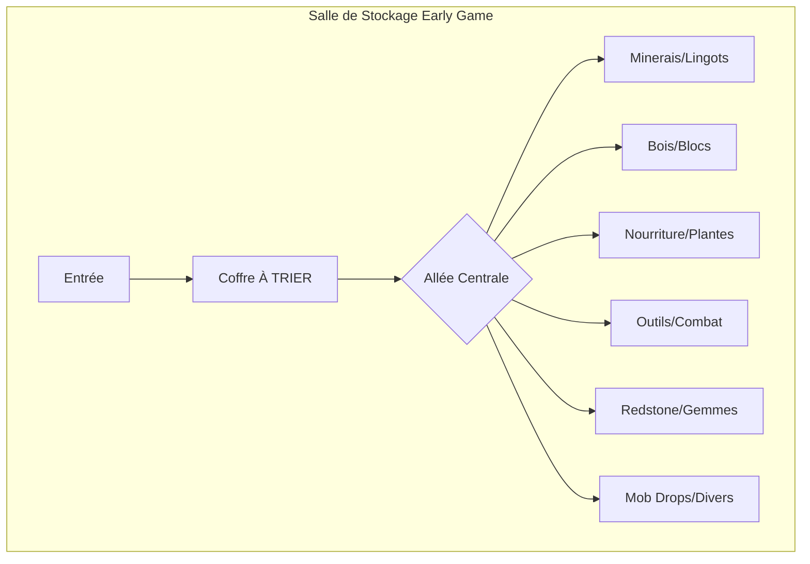

# Organisation des Coffres en Early Game

!!! tip "Conseil Essentiel"
    Une bonne organisation dès le début vous fera gagner des heures de jeu plus tard !

## 1. Pourquoi Organiser Tôt

L'organisation précoce de vos coffres est un investissement qui rapporte énormément :

- **Gain de temps énorme** - Plus besoin de chercher vos items pendant 10 minutes
- **Prépare pour l'automatisation** - Structure déjà en place pour les systèmes de stockage avancés
- **Évite la frustration** - Fini le chaos des coffres random !

!!! warning "Erreur Classique"
    Beaucoup de joueurs jettent tout dans un coffre unique au début. C'est une dette technique qui vous rattrapera !

---

## 2. Système de Catégories Recommandé

Voici un système de catégories testé et approuvé pour le early game :

| Catégorie | Contenu | Étiquette suggérée |
|-----------|---------|-------------------|
| **Minerais** | Ores, raw metals | :blue_square: Bleu |
| **Lingots** | Ingots, processed metals | :orange_square: Orange |
| **Blocs** | Building blocks, stone, dirt | :white_large_square: Gris |
| **Bois** | Logs, planks, sticks | :brown_square: Marron |
| **Nourriture** | Food items | :green_square: Vert |
| **Outils** | Tools, weapons, armor | :red_square: Rouge |
| **Redstone** | Redstone components | :heart: Rouge foncé |
| **Mob Drops** | Drops from monsters | :purple_square: Violet |
| **Plantes** | Seeds, crops, flowers | :herb: Vert clair |
| **Gemmes** | Diamonds, emeralds, lapis, etc. | :large_blue_diamond: Cyan |
| **Divers** | Everything else | :white_large_square: Blanc |

!!! info "Astuce"
    Commencez avec 5-6 catégories et ajoutez-en au fur et à mesure que vous progressez.

---

## 3. Layout de Salle de Stockage

### Schéma Recommandé



### Disposition Physique

```
┌─────────────────────────────────────────┐
│  [À TRIER]                              │
├─────────────────────────────────────────┤
│                                         │
│  ╔═══╗ ╔═══╗     ╔═══╗ ╔═══╗          │
│  ║MIN║ ║LIN║     ║BOI║ ║BLO║          │
│  ╚═══╝ ╚═══╝     ╚═══╝ ╚═══╝          │
│  [Sign] [Sign]   [Sign] [Sign]         │
│                                         │
│  ═══════════ ALLÉE ═══════════         │
│                                         │
│  ╔═══╗ ╔═══╗     ╔═══╗ ╔═══╗          │
│  ║NOU║ ║PLA║     ║OUT║ ║RED║          │
│  ╚═══╝ ╚═══╝     ╚═══╝ ╚═══╝          │
│  [Sign] [Sign]   [Sign] [Sign]         │
│                                         │
│  ╔═══╗ ╔═══╗     ╔═══╗ ╔═══╗          │
│  ║MOB║ ║GEM║     ║DIV║ ║DIV║          │
│  ╚═══╝ ╚═══╝     ╚═══╝ ╚═══╝          │
│  [Sign] [Sign]   [Sign] [Sign]         │
│                                         │
└─────────────────────────────────────────┘
```

!!! tip "Conseils de Layout"
    - **Double chests** en rangées pour maximiser le stockage
    - **Signs ou Item Frames** pour identifier chaque coffre
    - **Espace de circulation** d'au moins 2 blocs entre les rangées
    - **Éclairage suffisant** pour éviter les spawns de mobs

---

## 4. Progression du Stockage

=== "Jour 1-3"

    ### Phase Initiale

    - **Coffres basiques** en bois
    - **5-6 catégories simples** maximum
    - **Signs** pour les labels (économique)

    ```
    Catégories suggérées :
    1. Minerais & Lingots
    2. Bois & Blocs
    3. Nourriture
    4. Outils & Combat
    5. Divers
    ```

=== "Jour 3-7"

    ### Phase d'Expansion

    - :package: **Iron/Gold Chests** (mod Iron Chests)
    - **10+ catégories** plus spécifiques
    - **Item Frames** pour visualisation rapide

    ```
    Nouvelles catégories :
    - Séparer Minerais / Lingots
    - Ajouter Redstone
    - Ajouter Mob Drops
    - Ajouter Gemmes
    ```

=== "Semaine 2+"

    ### Phase Pré-Automatisation

    - :file_cabinet: **Storage Drawers** pour items en masse
    - **Drawer Controller** pour accès centralisé
    - **Préparer la transition** vers ME/RS

    !!! success "Objectif"
        À ce stade, votre système doit être prêt à être connecté à un réseau de stockage automatisé !

---

## 5. Mods Utiles Early Game

Ces mods transforment votre expérience de stockage dès le début :

| Mod | Description | Priorité |
|-----|-------------|----------|
| :package: **Iron Chests** | Coffres plus grands (Iron, Gold, Diamond, Obsidian) | :star::star::star: |
| :file_cabinet: **Storage Drawers** | Stockage compact pour items en masse | :star::star::star: |
| :label: **Storage Labels** | Labels visuels pour vos coffres | :star::star: |
| :mag: **Inventory Tweaks Renewed** | Auto-sort et raccourcis | :star::star::star: |
| :computer: **Inventory Profiles Next** | Gestion d'inventaire avancée | :star::star: |

!!! note "Compatibilité"
    Vérifiez que ces mods sont compatibles avec votre version de modpack !

---

## 6. Tips de Pro

### Règles d'Or

!!! success "Coffre À TRIER"
    **Toujours avoir un coffre "À TRIER"** près de l'entrée. Videz votre inventaire ici en rentrant, puis triez quand vous avez le temps.

### Raccourcis Essentiels

- **Shift+Click** - Transfert rapide d'un item
- **Shift+Double-Click** - Transfert tous les items identiques
- **JEI** - Clic sur un item pour voir dans quel coffre il se trouve

### Performance

!!! warning "Signs vs Item Frames"
    **Signs > Item Frames** pour la performance ! Les Item Frames sont des entités et peuvent causer du lag en grande quantité.

### Organisation Continue

- Triez **tous les 2-3 jours** maximum
- Ne laissez jamais le coffre "À TRIER" déborder
- **Étiquetez immédiatement** tout nouveau coffre

---

## 7. Template de Salle

### Salle de Stockage Idéale (Early Game)

```
                    ENTRÉE
                      │
                      ▼
    ┌─────────────────────────────────────┐
    │         ╔═══════════════╗           │
    │         ║   À TRIER     ║           │
    │         ╚═══════════════╝           │
    │                                     │
    │   ┌───┐ ┌───┐       ┌───┐ ┌───┐   │
    │   │MIN│ │MIN│       │LIN│ │LIN│   │
    │   └───┘ └───┘       └───┘ └───┘   │
    │   [Minerais]        [Lingots]      │
    │                                     │
    │   ┌───┐ ┌───┐       ┌───┐ ┌───┐   │
    │   │BOI│ │BOI│       │BLO│ │BLO│   │
    │   └───┘ └───┘       └───┘ └───┘   │
    │   [Bois]            [Blocs]        │
    │                                     │
    │   ════════════════════════════     │
    │            ALLÉE CENTRALE          │
    │   ════════════════════════════     │
    │                                     │
    │   ┌───┐ ┌───┐       ┌───┐ ┌───┐   │
    │   │NOU│ │PLA│       │OUT│ │ARM│   │
    │   └───┘ └───┘       └───┘ └───┘   │
    │   [Nourriture]      [Combat]       │
    │                                     │
    │   ┌───┐ ┌───┐       ┌───┐ ┌───┐   │
    │   │RED│ │GEM│       │MOB│ │DIV│   │
    │   └───┘ └───┘       └───┘ └───┘   │
    │   [Tech]            [Drops]        │
    │                                     │
    │         ┌─────────────┐            │
    │         │  CRAFTING   │            │
    │         │    TABLE    │            │
    │         └─────────────┘            │
    └─────────────────────────────────────┘

    Dimensions recommandées : 9x13 blocs minimum
    Hauteur : 4 blocs pour confort
```

!!! tip "Évolution"
    Ce template est conçu pour évoluer facilement vers un système Storage Drawers ou ME/RS !

---

## Checklist de Démarrage

- [ ] Creuser/construire une salle 9x13 minimum
- [ ] Placer le coffre "À TRIER" près de l'entrée
- [ ] Installer 10-12 double coffres
- [ ] Ajouter des signs pour chaque catégorie
- [ ] Prévoir de la place pour expansion
- [ ] Ajouter une table de craft centrale
- [ ] Éclairer correctement (éviter les mobs !)
